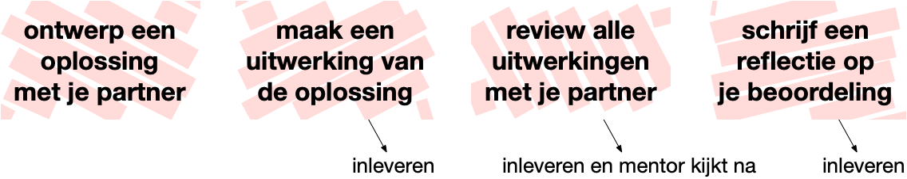

# Parttime Programmeren 1

## Studiewijzer <small>Herfst 2020</small>

> "Introduction to the intellectual enterprises of computer science and the art of programming. This course teaches you how to think algorithmically and solve problems efficiently. Topics include abstraction, algorithms, data structures, encapsulation, resource management, security, software engineering, and web development. Languages include Scratch, C and Python. Problem sets inspired by real-world domains of biology, cryptography, finance, forensics, and gaming. Designed for concentrators and non-concentrators alike, with or without prior programming experience." --- CS50 at Harvard.

## Mentor

Je wordt bij dit vak ingedeeld in een mentorgroep met 8--10 andere studenten. Je mentor is een ouderejaars student of een docent die alles over onze cursus weet. Je mentor helpt je wegwijs maken, doet voor hoe je het beste de opdrachten kunt aanpakken, kijkt je werk na, en kan jouw vragen over de organisatie van het vak beantwoorden. Je maakt kennis met je mentor tijdens de eerste bijeenkomst.

| Groep | Mentor | Link voor werkgroep |
| ----- | ------ | ------------------- |
| A     |        |                     |
| B     |        |                     |
| C     |        |                     |
| D     |        |                     |
| E     |        |                     |

Docenten zijn Jelle van Assema en Martijn Stegeman. Zij geven het vak vorm en verzorgen de organisatie. Je kunt ze bereiken via e-mail op <help@mprog.nl>.

## Opdrachten

In dit vak ga je verreweg de meeste tijd besteden aan het oplossen van programmeerproblemen. Het vak bestaat uit vijf modules die weer bestaan uit enkele opdrachten. Je werkt steeds volgens dit proces:

Iedere week tijdens de werkgroepen neemt je mentor het initiatief om te kijken wie gaat samenwerken en met welke partner. Code reviews zijn per definitie altijd met een andere student en je mentor zal zorgen dat er gerouleerd wordt. Zo doe je ervaring op met verschillende manieren om de opdrachten uit te werken en met verschillende ideeën rondom goede stijl.

## Vragen stellen

Tijdens dit vak zul je vaak de hulp inroepen van de assistenten en medestudenten. Er zijn vier belangrijke opties voor het stellen van vragen. De beste optie hangt af van het soort vraag dat je wil stellen.

1. Heb je vragen over hoe de cursus werkt, hoe je een vraag moet stellen, problemen met je computer of andere dingen die niet per se met de opdrachten te maken hebben, dan kun je deze het beste eerst stellen op de [Slack](/slack) van je mentorgroep. Je medestudenten en mentor denken met je mee. (Let op dat je mentor zeker niet 24/7 beschikbaar kan zijn, dus wees bescheiden.)
2. Voor vragen over de stof, hulp met programmeren, technische ondersteuning, plaats je zoveel mogelijk een vraag op [Ed](https://us.edstem.org/courses/365). Dit forum is online en altijd beschikbaar. Medestudenten en assistenten zullen zoveel mogelijk vragen beantwoorden.
3. Als je niet weet hoe je een vraag moet stellen of je weet niet waar je moet beginnen met het implementeren van je opdracht, dan is er video-assistentie. De assistentie is beschikbaar van maandag t/m vrijdag tussen 13 en 17 uur, en aanvragen doe je via deze website <svg class="bi" width="16" height="16" fill="currentColor"><use xlink:href="/icons/bootstrap-icons.svg#question-circle-fill"/></svg>. Let op dat het rondom deadlines vaak erg druk is en dat de wachttijd kan oplopen!
4. Voor het maken van persoonlijke planningsafspraken en het op de hoogte houden van de docenten over later inleveren stuur je een officiële mail naar <help@mprog.nl>.

Kom je helemaal niet verder en heb je even geen hulp?

- Neem een halfuurtje echt even afstand van je computer; dit helpt je brein afstand nemen van het probleem. Met een frisse blik kom je dan toch weer verder.

- Ga even door met de volgende opdracht van de module om te kijken hoe je daar mee gaat.

- Of ga oefenen in het basisboek, want dit staat helemaal los van de opdrachten.

## Verwachtingen

Om het vak te kunnen halen is het nodig dat je:

- alle **opdrachten** volgens bovenstaande proces maakt en inlevert,
- alle **videocolleges** bekijkt ter voorbereiding van de opdrachten,
- alle **werkgroepen** met je mentor bijwoont,
- alle dagen om 9:30 uur een **checkup** doet met je mentorgroep,
- alle **oefenopdrachten** doet,
- laag scoort op de **plagiaatschaal**, en
- tijdig **hulp** zoekt bij de medewerkers van de minor.

Studenten moeten minimaal aan bovenstaande **minimumeisen** voldoen om een voldoende te halen voor het vak. Dat moet goed te doen zijn! Is er een reden dat je niet aan een minimum kunt voldoen, dan moet je een *schriftelijke* uitzondering vragen aan de vakdocenten. We zullen daarin heel redelijk zijn.

Alle opdrachten worden wekelijks onderling en met eerdere inzendingen vergeleken met behulp van een detectieprogramma. De uitslag noemen we de **plagiaatschaal**. Scoor je hoog op de schaal dan spreek je op korte termijn met één van de docenten die je zal voorlichten en helpen met de beste aanpak voor dit vak. De ervaring leert dat je niet hoog scoort op de plagiaatschaal als je niet naar andermans uitwerkingen kijkt bij het maken van je eigen uitwerking. Maak je er dus geen zorgen over; ons doel is je te helpen dit te voorkomen.

Dit vak kent een **mondeling tentamen** dat na inleveren van de laatste opdracht op afspraak afgenomen kan worden. Scoor je systematisch laag op de plagiaatschaal, dan krijg je vrijstelling van het tentamen, omdat we dan voldoende informatie hebben om tot een eindoordeel te kunnen komen. Het mondeling bestaat uit het uitgebreid doorspreken van één of meer opdrachten, waarbij jij kunt uitleggen hoe je programma's precies werken en laten zien hoe je bepaalde aanpassingen zou kunnen doen.

## Uitzonderingen in tijden van Corona

Bij een fulltimecursus is het missen van een aantal dagen nogal lastig om in te halen, laat staan enkele weken. We hebben enige ruimte ingebouwd om met jou een persoonlijke planning af te kunnen spreken in gevallen van nood. Het enige dat je hoeft te doen is je bij ziekte direct te **melden** bij je mentor, en je **nogmaals** melden zodra je weer zo fit bent dat je kunt programmeren. Ben je langer dan een paar dagen ziek, neem dan zelf niet alleen contact op met je mentor, maar ook met de docenten.

## Deadlines

Elke module moet op de vooraf bepaalde deadline volledig werkend ingeleverd zijn, waarbij de correcte werking automatisch wordt getest met `check50`. Daarna volgt een deadline waarvoor je je werkende programma verbetert en nogmaals inlevert.

| onderdeel         | deadline oplossing | deadline verbeterd |  
| ----------------- | ------------------ | ------------------ |
| Module 0          | vr  4 sep  20:59   | -                  |  
| Module 1          | vr 11 sep  20:59   | di 18 feb  20:59   |  
| Module 2          | vr 18 sep  20:59   | di 25 feb  20:59   |  
| Module 3          |                    |                    |  
| - Find            | vr 25 sep  20:59   | di 10 mrt  20:59   |  
| - Fifteen         | vr  2 okt  20:59   | di 10 mrt  20:59   |  
| Module 4          |                    |                    |  
| - Whodunit/Filter | vr  9 okt  20:59   | di 24 mrt  20:59   |  
| - Recover         | vr 16 okt  20:59   | di 24 mrt  20:59   |  

Wat als ik ziek ben of achterloop?

In het geval van planningsproblemen of kortdurende ziekte is het mogelijk de oplossingsdeadline met 1 tot 3 dagen op te schuiven, in ruil voor een bescheiden puntenaftrek. Dit gaat automatisch, maar breng altijd direct je mentor op de hoogte en vraag om advies over het halen van verdere deadlines.

Voor module 0 is geen uitstel mogelijk. Je moet op tijd gestart zijn met het vak om mee te mogen doen.

Nog later ingeleverd werk kan normaliter niet geaccepteerd worden, behalve in medische noodgevallen. Dat betekent dat je het vak niet kunt halen als je het tempo echt niet bijhoudt. In dat geval is het noodzakelijk om direct contact op te nemen met de docenten via <help@mprog.nl>, maar zeker vóór je doorgaat met werken aan de opdrachten. Vaak zijn er nog wel oplossingen te verzinnen.

## Eindcijfer

Modules 1 t/m 4 kunnen elk 0--6 punten opleveren, en voor elke module zijn diverse aspecten aangegeven op basis waarvan de punten voornamelijk (maar niet uitsluitend) worden bepaald.
De aspecten gaan over *codekwaliteit*, waarover je in module 1 meer leert. De schaal is als volgt:

6. uitzonderlijk goede kwaliteit op basis van een doordacht ontwerp
5. zeer goede kwaliteit, beperkt ruimte voor verbetering
4. degelijke kwaliteit op de genoemde aspecten, met ruimte voor verbetering
3. net voldoende aandacht voor de genoemde aspecten, erg veel ruimte voor verbetering
2. enige zichtbare aandacht voor een beperkt aantal aspecten
1. onvoldoende zichtbare aandacht voor de kwaliteitsaspecten
0. niet genoeg code om te beoordelen
{: start="6" reversed=""}

Bij later inleveren voor de **oplossingsdeadline** geldt de volgende aftrek:

| uitstel          | aftrek                            |  
| ---------------- | --------------------------------- |  
| maximaal 1 dag   | 1/2 punt, en hacker telt niet mee |  
| maximaal 3 dagen | 1 punt                            |  

Het eindcijfer voor deze cursus wordt bepaald door het totaal aantal punten voor de modules. De puntenscore leidt tot een cijfer tussen 1 en 10, afgerond op halven, zoals gebruikelijk. Dat komt neer op de volgende weging tussen de modules:

| onderdeel | telt mee |  
| --------- | -------- |
| Module 0  | 0%       |  
| Module 1  | 25%      |  
| Module 2  | 25%      |  
| Module 3  | 25%      |  
| Module 4  | 25%      |  

<!-- Toetsjes leveren geen punten op voor het eindcijfer, maar moeten wel gehaald worden. -->

## Onderdelen

### Hoorcolleges

In hoorcolleges bespreekt David Malan van Harvard de theorie waarmee je programmeerproblemen kunt oplossen en die je voorbereidt op de oefeningen. De video's zijn een voorbereiding op de opdrachten en bevatten allerlei voorbeelden die je vaak direct kunt toepassen. <!-- Kijk de video's vóór of onderweg naar het lab, zodat je je tijd in het lab goed kan gebruiken voor programmeren en vragen stellen. -->

### Werkgroepen

Werkgroepen zijn bijeenkomsten van zo'n 30--60 minuten met je mentor. In de werkgroepen krijg je de kans om samen de voortgang te bespreken, de oefeningen door te nemen, tips uit te wisselen over het aanpakken van problemen en om je medestudenten en mentor beter te leren kennen. Gebruik van camera is vereist (laat weten als je omgeving niet geschikt is om te kunnen videobellen, dan kijken we of we een alternatieve werkplek kunnen vinden).

### Oefeningen

Wekelijks zijn er oefeningen waarin de stof van de vorige weken wordt herhaald en aangescherpt. Gedeeltelijk studeer je in het [Basisboek Programmeren](https://www.stgm.nl/basics/) dat vrij beschikbaar is. De resterende oefeningen zijn te vinden op deze website. Jouw antwoorden op de oefeningen worden doorgenomen tijdens de werkgroepen.

### Werkuren

Tijdens de werkuren, dagelijks van 9 tot 17 uur, word je geacht te werken aan dit vak. Je ontwerpt en programmeert dan aan je opdrachten en je wisselt ideeën en oefeningen uit met de studenten uit je mentorgroep. Let daarbij wel op dat je op een "redelijke" manier samenwerkt, zoals vermeld aan het einde van deze studiewijzer.

### Checkup

Elke dag om 9:30 doe je een video-checkup met je mentorgroep, maar zonder je mentor. Daarbij laat je weten hoe je ervoor staat met je opdracht, waar je aan gewerkt hebt en vooral waar je vandaag aan wil werken. Je kunt ook om advies vragen over je aanpak, bijvoorbeeld als je vastzit. Misschien is er een groepsgenoot die hetzelfde probleem al is tegengekomen.

### Boeken

Wil je naast de videocolleges nog eens rustig lezen over de verschillende onderwerpen, dan kunnen de volgende boeken je verder op weg helpen. Ze zijn niet noodzakelijk voor het halen van het vak.

*Voor mensen die nog nooit geprogrammeerd hebben*

C Programming Absolute Beginner's Guide, Third Edition  
Greg Perry, Dean Miller  
Pearson Education, 2014  
ISBN 9780789751980

*Voor studenten met iets meer ervaring*

Programming in C, Fourth Edition  
Stephen G. Kochan  
Pearson Education, 2015  
ISBN 9780321776419

## Herkansingen

Onderstaande regelingen zijn wat streng geformuleerd, maar het is niet de bedoeling dat ze echt nodig zijn! Als je doorzet en de opdrachten afmaakt dan zou je de cursus gewoon moeten halen. Maak je er dus niet teveel zorgen over, maar neem wel direct contact op met de docenten (niet de assistenten) als je denkt dat je in de problemen komt met de planning en/of je cijfers. Wij hebben veel ervaring en kunnen je adviseren!

Ik heb alles werkend, maar sta een onvoldoende en wil herkansen

  - Alle modules, ook die voldoende waren, moeten opnieuw worden ingeleverd.

  - Alle programma's moeten verbeterd worden ten aanzien van de kwaliteitsaspecten.

  - Het maximumcijfer is in dit geval een 6.0 en wordt alleen toegekend als alle programma's aantoonbaar van voldoende kwaliteit zijn (waarmee je aantoont het betreffende leerdoel gehaald te hebben).

Ik heb een opdracht niet werkend ingeleverd en wil herkansen

  - Herkansen kan pas vanaf het eerstvolgende semester waarin het vak wordt gegeven.

  - Alle modules die niet af waren (en dus niet beoordeeld) moeten opnieuw of alsnog worden ingeleverd.

  - Modules die af en beoordeeld waren mogen niet opnieuw worden ingestuurd. Het oude cijfer blijft staan, met uitzondering van opdrachten die zijn vervangen door nieuwe.

  - Vernieuwde opdrachten moeten op moment van herkansen gewoon gedaan worden.

  - Alle nieuwe beoordelingen vinden plaats zoals gangbaar op het moment van herkansen.

Ik heb niet aan de minimumeisen voldaan en wil herkansen

  - Herkansen kan pas vanaf het eerstvolgende semester waarin het vak wordt gegeven.

  - Er moet een concrete afspraak zijn over het inhalen van minimumeisen vóór je start. Neem hiervoor contact op met de docenten.

<!-- - Alle toetsjes moeten opnieuw gedaan worden indien de samenstelling inmiddels is veranderd. -->

## Samenwerken, fraude en plagiaat

"Wees redelijk" is kort samengevat het beleid van dit vak. Natuurlijk is het nuttig om interactie te hebben met je medestudenten en dat dit kan helpen bij het beheersen van de stof. Nog sterker, we stimuleren dit door je te vragen samen een ontwerp te maken van je programma's vóórdat je ze zelfstandig implementeert. Maar er is een grens tussen het vragen van hulp aan een ander en het inleveren van werk van een ander. Hier karakteriseren we beide kanten van die grens.

De essentie van alles wat je inlevert moet van jou afkomstig zijn. Je mag niet samenwerken aan de *implementatie* van je programma's. Uitzondering is dat je klasgenoten en anderen om hulp mag vragen, zolang dat er niet op neer komt dat een ander een deel van het werk voor jou doet. Over het algemeen mag je, als je om hulp vraagt, jouw code laten zien, maar kijk je niet naar de code van een ander. Je laat je dus ook niks voorzeggen.

Hieronder vind je een incomplete lijst van voorbeelden die een beeld schetsen van welke handelingen we als redelijk en onredelijk bestempelen. Twijfel je of een handeling redelijk is, vraag het, en wacht tot je per e-mail toestemming hebt gekregen van een docent. Als je onredelijk handelt dan zal dit leiden tot een melding bij de examencommissie.

Voorbeelden van **redelijke** acties

* Praten met je klasgenoten over de opdrachten in het Nederlands (of een ander gesproken taal).

* Het cursusmateriaal bespreken met anderen om het beter te begrijpen.

* Een klasgenoot helpen bij het debuggen tijdens een laptopcollege of daarbuiten, of zelfs online, door het bekijken, compileren of draaien van zijn of haar code, zelfs op je eigen computer.

* Het opnemen van een paar regels code die je online of ergens anders vindt in jouw eigen code, gegeven dat deze regels niet oplossingen vormen tot opdrachten en dat je de bron van de code vermeldt.

* Het inzien van tentamens van voorgaande jaren en oplossingen daarvan.

* Versturen of code laten zien die jij hebt geschreven aan iemand anders, wellicht een klasgenoot, zodat hij of zij kan helpen bij het debuggen.

* Het online delen van een paar regels van jouw code zodat anderen wellicht kunnen helpen met debuggen.

* Op een assistent afstappen voor hulp tijdens de laptopcolleges.

* Naar het internet of ergens anders gaan voor instructies buiten het vak, voor referenties, en voor oplossingen op technische problemen, maar niet voor gehele oplossingen voor opdrachten.

* Het uittekenen of uitwerken van oplossingen op een whiteboard door middel van diagrammen of pseudocode, maar niet "echte" code.

* Werken met (en zelfs betalen voor) een tutor om je te helpen met het vak, gegeven dat de tutor niet het werk voor je doet.

Voorbeelden van **onredelijke** acties

* Een oplossing van een opdracht inzien voordat je jouw opdracht hebt ingeleverd.

* Een klasgenoot vragen om zijn of haar oplossing, voordat je jouw opdracht hebt ingeleverd.

* Het decompileren, deobfuscereen, of demonteren van een "staff" oplossing van een opdracht.

* Vergeten de bron te citeren van code of technieken die je hebt opgenomen van buiten de lessen van dit vak, en hebt geïntegreerd in je eigen werk, zelfs als je wel de andere restricties aanhoudt.

* Geven, of laten zien, van een oplossing voor een opdracht aan een klasgenoot waar hij of zij, dus niet jij, moeite mee heeft om op te lossen.

* Betalen, of het aanbieden om te betalen, voor het recht om werk van een ander als onderdeel van jouw eigen werk in te leveren.

* Het beschikbaar stellen van oplossingen voor opdrachten van dit vak aan anderen die dit vak in de toekomst wellicht gaan volgen.

* Het opzoeken van complete oplossingen voor opdrachten online of ergens anders.

* Werk van een opdracht opsplitsen met een ander.

* Werk van een ander, behalve een paar regels zoals eerder omschreven, inleveren.

* Hetzelfde of bijna hetzelfde werk inleveren bij dit vak dat je hebt ingeleverd of gaat inleveren bij een ander vak.

* Het inleveren van werk voor dit vak, waarbij je intentie is om dit ook ergens anders voor in te zetten (zeg voor een baan), zonder daar eerst toestemming voor te hebben gekregen van een docent.

* Naar de oplossing voor een opdracht van iemand anders kijken, en vervolgens jouw oplossing daarop baseren.

In alle gevallen volgen we de [plagiaatregeling](http://uva.nl/plagiaat) van de Universiteit van Amsterdam en de richtlijnen van de examencommissie voor de Minor Programmeren.
