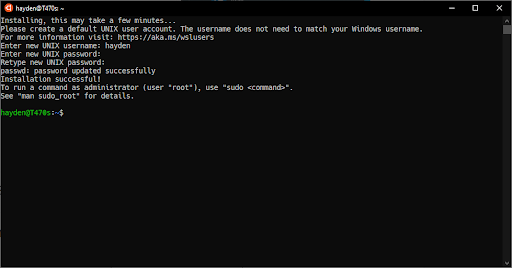

# Windows: Installing using WSL

To develop with C you need some tools on your laptop. This guide helps you with installing all these tools.

We will be using the [_Windows Subsystem for Linux 2_](https://aka.ms/wsl2).

Note: These instructions are written for Windows 10 and 11. If you are using Windows 8 or older please follow [these](/extra/installatie/windows8) instructions.

## Step 1: Install the Windows Subsystem for Linux

Start with opening PowerShell as Administrator.
Right-click the Start button and click "Windows PowerShell (Admin)".
Then enter the following command:

    wsl --install

Old instructions (only if the command above is not recognized)

### Step 1.1: Install the Windows Subsystem for Linux

Run:

    dism.exe /online /enable-feature /featurename:Microsoft-Windows-Subsystem-Linux /all /norestart

This will install the Windows Subsystem for Linux.

### Step 1.2: Update to WSL 2

To get better performance we want the upgrade to WSL 2.

Run:

    dism.exe /online /enable-feature /featurename:VirtualMachinePlatform /all /norestart

This will enable the "Virtual Machine Platform", which is needed for WSL2.

Then enable WSL2:

    wsl --set-default-version 2

This might result in `WSL 2 requires an update to its kernel component. For information please visit https://aka.ms/wsl2kernel`.
Go to <https://aka.ms/wsl2kernel> and install the update and retry the command above.

### Step 1.3: Install Ubuntu for WSL

Head to [Microsoft Store Ubuntu](https://www.microsoft.com/nl-nl/p/ubuntu/9nblggh4msv6)-page. And install Ubuntu 20.04.

**Remember to reboot your computer after installing WSL.**

## Step 2: Create an account

1.  Open up the Ubuntu terminal. Do this by pressing the Windows key on your keyboard, then type Ubuntu and click on the app.

2.  Ubuntu will now launch, this will take a few minutes.

    If you get the following error **please ask the staff for help**.

        WslRegisterDistribution failed with error: 0x80370102
        Error: 0x80370102 The virtual machine could not be started because a required feature is not installed.

3.  Enter a username and password for Ubuntu.  
    **Linux will not show any characters while entering a password; this is normal.**

## Step 3: Tools

Open the Ubuntu terminal and enter the following line:

    /bin/bash -c "$(curl -fsSL https://raw.githubusercontent.com/uvapl/installer/main/run.sh)"

Note: you can paste into your terminal using right-click.

The above is a script that will guide you through most of the installation. Whenever you get error messages that you don't understand, please contact the course's staff for help.

## Step 4: Atom

Download and install [Atom](https://atom.io/).
