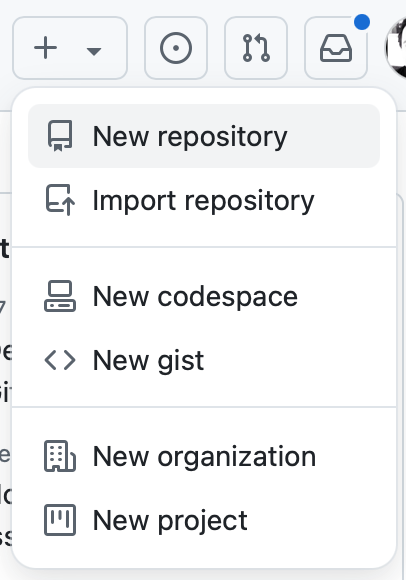
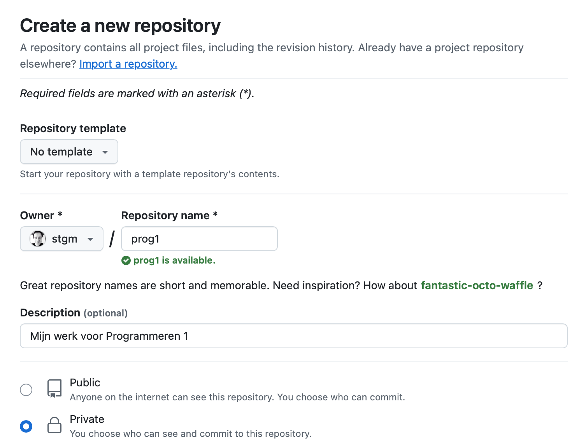

# Terra IDE

De Terra IDE is gebaseerd op componenten van de CS50 IDE. Om de IDE te gebruiken in onze cursus moet je een **Github**-account maken. Hierin wordt je werk voortdurend opgeslagen, zodat je niks kwijtraakt.

## Github-account

[Maak een account op Github](https://github.com/signup). Dit mag anoniem zijn, maar veel mensen gebruiken hun Github-account ook om hun professionele (programmeer-)werk op te publiceren.

## Een "repository"

Elk project op Github krijgt een eigen repository. Je gaat er eentje maken voor deze cursus. Kies **New Repository** in het menu:

Gebruik de volgende opties (private!) en laat de andere opties zoals ze zijn:

## Toegang maken

Om Github te koppelen aan de IDE, moet je een key aanmaken.

- Ga naar de pagina [New Personal Access Token](https://github.com/settings/personal-access-tokens/new)
- Noem de token **Proglab**
- De **Expiration** mag op 90 dagen
- Kies bij **Repository access** voor "Only select repositories"
- Klik dan op **Select repositories** en zoek de naam van de repo die je net hebt aangemaakt
- Klap **Repository permissions** uit en zet de optie **Contents** op "Read and write"

Klik nu op **Generate Token**. Pas op! De lange string met letters en cijfers wordt maar één keer getoond. Hou de tab dus open! 

## Koppelen aan Terra

- [Ga naar de Terra IDE](https://ide.proglab.nl/)
- Kies in het Git-menu voor **Add credentials** en plak daar het token, sla op.
- Kies in het Git-menu voor **Connect repository** en vul daar jouw github-repo in. Die ziet er zo uit;

        https://github.com/<githubusername>/<githubreponame

Vul jouw gegevens daarin in, zonder de `<>`

