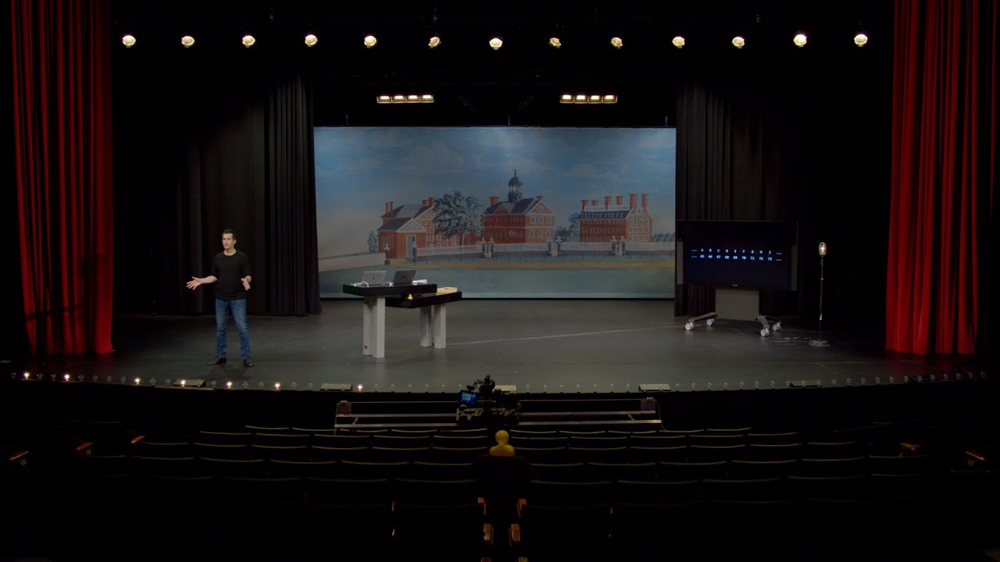

# Lecture: Computational thinking

<a href="https://video.cs50.io/YoXxevp1WRQ?screen=mu28ADhzRQE"><figure>
<figcaption>Open in CS50 video player</figcaption></figure></a>

## Welcome

*   This year, we'll be in the [Loeb Drama Center](https://americanrepertorytheater.org/venue/loeb-drama-center-3/) at Harvard University, where, thanks to our close collaboration with the [American Repertory Theater](https://americanrepertorytheater.org/), we have an amazing stage and even props for demonstrations.
*   We turned an 18th century [watercolor painting of Harvard's campus](https://images.hollis.harvard.edu/permalink/f/100kie6/HVD_VIAolvwork671391) by a student, Jonathan Fisher, into the backdrop for the stage.
*   Twenty years ago as an undergraduate, David overcame his own trepidation, stepping outside his comfort zone and took CS50 himself, finding that the course was less about programming than about problem solving.
*   In fact, two-thirds of CS50 students have never taken a computer science course before.
*   And importantly, too:

    > what ultimately matters in this course is not so much where you end up relative to your classmates but where you end up relative to yourself when you began

*   We'll start off the course recreating a component of a [Super Mario game](https://en.wikipedia.org/wiki/Super_Mario_Bros.), later building a web application called CS50 Finance that will allow users to buy and sell stocks virtually, and ending the course with the creation of your very own final project.

## What is computer science?

*   Computer science is fundamentally problem solving.
*   We can think of **problem solving** as the process of taking some input (details about our problem) and generate some output (the solution to our problem). The "black box" in the middle is computer science, or the code we'll learn to write.  
    
*   To begin doing that, we'll need a way to represent inputs and outputs, so we can store and work with information in a standardized way.

## Representing numbers

*   We might start with the task of taking attendance by counting the number of people in a room. With our hand, we might raise one finger at a time to represent each person, but we won't be able to count very high. This system is called **unary**, where each digit represents a single value of one.
*   We've probably learned a more efficient system to represent numbers, where we have ten digits, 0 through 9:

    <pre>0 1 2 3 4 5 6 7 8 9
    </pre>

    *   This system is called decimal, or **base 10**, since there are ten different values that a digit can represent.
*   Computers use a simpler system called **binary**, or base two, with only two possible digits, 0 and 1.
    *   Each _binary digit_ is also called a **bit**.
*   Since computers run on electricity, which can be turned on or off, we can conveniently represent a bit by turning some switch on or off to represent a 0 or 1.
    *   With one light bulb, for example, we can turn it on to count to 1.
*   With three light bulbs, we can turn them on in different patterns, and count from 0 (with all three off) to 7 (with all three on):  
      
      
      
      
      
      
      
    
*   Inside modern computers, there are not light bulbs but million of tiny switches called **transistors** that can be turned on and off to represent different values.
*   For example, we know the following number in decimal represents one hundred and twenty-three.

    <pre>1 2 3
    </pre>

    *   The `3` is in the ones column, the `2` is in the tens column, and the `1` is in the hundreds column.
    *   So `123` is `100×1 + 10×2 + 1×3 = 100 + 20 + 3 = 123`.
    *   Each place for a digit represents a power of ten, since there are ten possible digits for each place. The rightmost place is for 100, the middle one 101, and the leftmost place 102:

        <pre>102 101 100
        1   2   3
        </pre>

*   In binary, with just two digits, we have powers of two for each place value:

    <pre>22 21 20
    #  #  #
    </pre>

    *   This is equivalent to:

        <pre>4  2  1
        #  #  #
        </pre>

*   With all the light bulbs or switches off, we would still have a value of 0:

    <pre>4 2 1
    **0 0 0**
    </pre>

*   Now if we change the binary value to, say, `0 1 1`, the decimal value would be 3, since we add the 2 and the 1:

    <pre>4 2 1
    **0 1 1**
    </pre>

*   If we had several more light bulbs, we might have a binary value of `110010`, which would have the equivalent decimal value of `50`:

    <pre>32 16  8  4  2  1
     **1  1  0  0  1  0**
    </pre>

    *   Notice that `32 + 16 + 2 = 50`.
*   With more bits, we can count up to even higher numbers.

## Text

*   To represent letters, all we need to do is decide how numbers map to letters. Some humans, many years ago, collectively decided on a standard mapping of numbers to letters. The letter "A", for example, is the number 65, and "B" is 66, and so on. By using context, like whether we're looking at a spreadsheet or an email, different programs can interpret and display the same bits as numbers or text.
*   The standard mapping, [**ASCII**](https://en.wikipedia.org/wiki/ASCII), also includes lowercase letters and punctuation.
*   If we received a text message with a pattern of bits that had the decimal values `72`, `73`, and `33`, those bits would map to the letters `HI!`. Each letter is typically represented with a pattern of eight bits, or a **byte**, so the sequences of bits we would receive are `01001000`, `01001001`, and `00100001`.
    *   We might already be familiar with using bytes as a unit of measurement for data, as in megabytes or gigabytes, for millions or billions of bytes.
*   With eight bits, or one byte, we can have 28, or 256 different values (including zero). (The _highest value_ we can count up to would be 255.)
*   Other characters, such as letters with accent marks and symbols in other languages, are part of a standard called [**Unicode**](https://en.wikipedia.org/wiki/Unicode), which uses more bits than ASCII to accommodate all these characters.
    *   When we receive an emoji, our computer is actually just receiving a number in binary that it then maps to the image of the emoji based on the Unicode standard.
        *   For example, the "face with tears of joy" emoji is just the bits `000000011111011000000010`:  
            

## Images, video, sounds

*   An image, like the picture of the emoji, are made up of colors.
*   With only bits, we can map numbers to colors as well. There are many different systems to represent colors, but a common one is **RGB**, which represents different colors by indicating the amount of red, green, and blue within each color.
*   For example, our pattern of bits earlier, `72`, `73`, and `33` might indicate the amount of red, green, and blue in a color. (And our programs would know those bits map to a color if we opened an image file, as opposed to receiving them in a text message.)
    *   Each number might be a byte, with 256 possible values, so with three bytes, we can represent millions of colors. Our three bytes from above would represent a dark shade of yellow:  
        
*   The dots, or squares, on our screens are called **pixels**, and images are made up of many thousands or millions of those pixels as well. So by using three bytes to represent the color for each pixel, we can create images. We can see pixels in an emoji if we zoom in, for example:  
    
*   The **resolution** of an image is the number of pixels there are, horizontally and vertically, so a high-resolution image will have more pixels and require more bytes to be stored.
*   Videos are made up of many images, changing multiple times a second to give us the appearance of motion, as an old-fashioned [flipbook](https://youtu.be/p3q9MM__h-M) might do.
*   Music can be represented with bits, too, with mappings of numbers to notes and durations, or more complex mappings of bits to sound frequencies at each moment of time.
*   File formats, like JPEG and PNG, or Word or Excel documents, are also based on some standard that some humans have agreed on, for representing information with bits.

## Algorithms

*   Now that we can represent inputs and outputs, we can work on problem solving. The black box earlier will contain **algorithms**, step-by-step instructions for solving problems:  
    
*   Humans can follow algorithms too, such as recipes for cooking. When programming a computer, we need to be more precise with our algorithms so our instructions aren't ambiguous or misinterpreted.
*   We might have an application on our phones that store our contacts, with their names and phone numbers sorted alphabetically. The old-school equivalent might be a phone book, a printed copy of names and phone numbers.
*   Our input to the problem of finding someone's number would be the phone book and a name to look for. We might open the book and start from the first page, looking for a name one page at a time. This algorithm would be **correct**, since we will eventually find the name if it's in the book.
*   We might flip through the book two pages at a time, but this algorithm will not be correct since we might skip the page with our name on it. We can fix this **bug**, or mistake, by going back one page if we flipped too far, since we know the phone book is sorted alphabetically.
*   Another algorithm would be opening the phone book to the middle, decide whether our name will be in the left half or right half of the book (because the book is alphabetized), and reduce the size of our problem by half. We can repeat this until we find our name, dividing the problem in half each time. With 1024 pages to start, we would only need 10 steps of dividing in half before we have just one page remaining to check. We can see this visualized in an [animation of dividing a phone book in half repeatedly](https://youtu.be/F5LZhsekEBc), compared to the [animation of searching one page at a time](https://youtu.be/-yTRajiUi5s).
*   In fact, we can represent the efficiency of each of those algorithms with a chart:  
    
    *   Our first solution, searching one page at a time, can be represented by the red line: our time to solve increases linearly as the size of the problem increases. _n_ is a some number representing the size of the problem, so with _n_ pages in our phone books, we have to take up to _n_ steps to find a name.
    *   The second solution, searching two pages at a time, can be represented by the yellow line: our slope is less steep, but still linear. Now, we only need (roughly) _n_ / 2 steps, since we flip two pages at a time.
    *   Our final solution, dividing the phone book in half each time, can be represented by the green line, with a fundamentally different relationship between the size of the problem and the time to solve it: [**logarithmic**](https://en.wikipedia.org/wiki/Logarithm), since our time to solve rises more and more slowly as the size of the problem increases. In other words, if the phone book went from 1000 to 2000 pages, we would only need one more step to find our name. If the size doubled again from 2000 to 4000 pages, we would still only need one more step. The green line is labeled log2 _n_, or log base 2 of _n_, since we're dividing the problem by two with each step.
*   When we write programs using algorithms, we generally care not just how correct they are, but how **well-designed** they are, considering factors such as efficiency.

## Pseudocode

*   We can write **pseudocode**, which is a representation of our algorithm in precise English (or some other human language):

    <pre>1  Pick up phone book
    2  Open to middle of phone book
    3  Look at page
    4  If person is on page
    5      Call person
    6  Else if person is earlier in book
    7      Open to middle of left half of book
    8      Go back to line 3
    9  Else if person is later in book
    10     Open to middle of right half of book
    11     Go back to line 3
    12 Else
    13     Quit
    </pre>

    *   With these steps, we check the middle page, decide what to do, and repeat. If the person isn't on the page, and there's no more pages in the book left, then we stop. And that final case is particularly important to remember. When other programs on our computers forgot that final case, they might appear to freeze or stop responding, since they've encountered a case that wasn't accounted for, or continue to repeat the same work over and over behind the scenes without making any progress.
*   Some of these lines start with verbs, or actions. We'll start calling these _functions_:

    <pre>1  **Pick up** phone book
    2  **Open to** middle of phone book
    3  **Look at** page
    4  If person is on page
    5      **Call** person
    6  Else if person is earlier in book
    7      **Open to** middle of left half of book
    8      Go back to line 3
    9  Else if person is later in book
    10     **Open to** middle of right half of book
    11     Go back to line 3
    12 Else
    13     **Quit**
    </pre>

*   We also have branches that lead to different paths, like forks in the road, which we'll call _conditions_:

    <pre>1  Pick up phone book
    2  Open to middle of phone book
    3  Look at page
    4  **If** person is on page
    5      Call person
    6  **Else if** person is earlier in book
    7      Open to middle of left half of book
    8      Go back to line 3
    9  **Else if** person is later in book
    10     Open to middle of right half of book
    11     Go back to line 3
    12 **Else**
    13     Quit
    </pre>

*   And the questions that decide where we go are called _Boolean expressions_, which eventually result in a value of yes or no, or true or false:

    <pre>1  Pick up phone book
    2  Open to middle of phone book
    3  Look at page
    4  If **person is on page**
    5      Call person
    6  Else if **person is earlier in book**
    7      Open to middle of left half of book
    8      Go back to line 3
    9  Else if **person is later in book**
    10     Open to middle of right half of book
    11     Go back to line 3
    12 Else
    13     Quit
    </pre>

*   Lastly, we have words that create cycles, where we can repeat parts of our program, called _loops_:

    <pre>1  Pick up phone book
    2  Open to middle of phone book
    3  Look at page
    4  If person is on page
    5      Call person
    6  Else if person is earlier in book
    7      Open to middle of left half of book
    8      **Go back to line 3**
    9  Else if person is later in book
    10     Open to middle of right half of book
    11     **Go back to line 3**
    12 Else
    13     Quit
    </pre>

## Scratch

*   We can write programs with the building blocks we just discovered:
    *   functions
    *   conditions
    *   Boolean expressions
    *   loops
*   And we'll discover additional features including:
    *   variables
    *   threads
    *   events
    *   …
*   Before we learn to use a text-based programming language called C, we'll use a graphical programming language called [Scratch](https://scratch.mit.edu/), where we'll drag and drop blocks that contain instructions.
*   A simple program in C that prints out "hello, world", would look like this:

    

    

        #include <stdio.h>

        int main(void)
        {
            printf("hello, world\n");
        }

    

    

    *   There's a lot of symbols and syntax, or arrangement of these symbols, that we would have to figure out.
*   The programming environment for Scratch is a little more friendly:  
    
    *   On the top right, we have a stage that will be shown by our program, where we can add or change backgrounds, characters (called sprites in Scratch), and more.
    *   On the left, we have puzzle pieces that represent functions or variables, or other concepts, that we can drag and drop into our instruction area in the center.
    *   On the bottom right, we can add more characters for our program to use.
*   We can drag a few blocks to make Scratch say "hello, world":  
    
    *   The "when green flag clicked" block refers to the start of our program (since there is a green flag above the stage that we can use to start it), and below it we've snapped in a "say" block and typed in "hello, world". And we can figure out what these blocks do by exploring the interface and experimenting.
*   We can also drag in the "ask and wait" block, with a question like "What's your name?", and combine it with a "say" block for the answer:  
    
    *   The "answer" block is a variable, or value, that stores what the program's user types in, and we can place it in a "say" block by draggind and dropping as well.
*   But we didn't wait after we said "Hello" with the first block, so we can use the "join" block to combine two phrases so our cat can say "hello, David":  
    
    *   When we try to nest blocks, or place them one inside the other, Scratch will help us by expanding places where they can be used.
*   In fact, the "say" block itself is like an algorithm, where we provided an input of "hello, world" and it produced the output of Scratch (the cat) "saying" that phrase:  
    
*   The "ask" block, too, takes in an input (the question we want to ask), and produces the output of the "answer" block:  
    
*   We can then use the "answer" block along with our own text, "hello, ", as two inputs to the join algorithm …  
    
*   … the output of which we pass can as input to the "say" block:  
    
*   At the bottom left of the screen, we see an icon for extensions, and one of them is called Text to Speech. After we add it, we can use the "speak" block to hear our cat speak:  
    
*   The Text to Speech extension, thanks to the cloud, or computer servers on the internet, is converting our text to audio.
*   We can try to make the cat say meow:  
    
    *   We can have it say meow three times, but now we're repeating blocks over and over.
*   Let's use a loop, or a "repeat" block:  
    
    *   Now our program achieves the same results, but with fewer blocks. We can consider it to have a better design: if there's something we wanted to change, we would only need to change it in one place instead of three.
*   We can have the cat point towards the mouse and move towards it:  
    
*   We try out the Pen extension, by using the "pen down" block with a condition:  
    
    *   Here, we move the cat to the mouse pointer, and if the mouse is clicked, or down, we put the "pen down", which draws. Otherwise, we put the pen up. We repeat this very quickly, over and over again, so we end up with the effect of drawing whenever we have the mouse held down.
*   Scratch also has different costumes, or images, that we can use for our characters.
*   We'll make a program that can count:  
    
    *   Here, `counter` is a variable, the value of which we can set, use, and change.
*   We look at some more programs, like [bounce](https://scratch.mit.edu/projects/277536611/editor/), where the cat moves back and forth on the screen forever, by turning around whenever we're at the edge of the screen.
    *   We can improve the animation by having the cat change to a different costumes after every 10 steps in [bounce1](https://scratch.mit.edu/projects/277536630/editor/). Now when we click the green flag to run our program, we see the cat alternate the movement of its legs.
*   We can even record our own sounds with our computer's microphone, and play them in our program.
*   To build more and more complex programs, we start with each of these simpler features, and layer them atop one another.
*   We can also have Scratch meow if we touch it with the mouse pointer, in [pet0](https://scratch.mit.edu/projects/277537223/editor/).
*   In [bark](https://scratch.mit.edu/projects/326130490/editor/), we have not one but two programs in the same Scratch project. Both of these programs will run at the same time after the green flag is clicked. One of these will play a sea lion sound if the `muted` variable is set to `false`, and the other will set the `muted` variable from either `true` to `false`, or `false` to `true`, if the space key is pressed.
*   Another extension looks at the video as captured by our computer's webcam, and plays the meow sound if the video has motion above some threshold.
*   With multiple sprites, or characters, we can have different sets of blocks for each of them:  
    
    *   For one puppet, we have these blocks that say "Marco!", and then a "broadcast event" block. This "event" is used for our two sprites to communicate with each other, like sending a message behind the scenes. So our other puppet can just wait for this "event" to say "Polo!":  
        
*   We can use the Translate extension to say something in other languages, too:  
    
    *   Here, the output of the "join" block is use as the input to the "translate" block, the output of which is passed as input to the "say" block.
*   Now that we know some basics, we can think about the design, or quality of our programs. For example, we might want to have the cat meow three times with the "repeat" block:  
    
*   We can use **abstraction**, which simplifies a more complex concept. In this case, we can define our own "meow" block in Scratch, and reuse it elsewhere in our program, as seen in [meow3](https://scratch.mit.edu/projects/421542702/editor/). The advantage is that we don't need to know how meowing is implemented, or written in code, but rather just use it in our program, making it more readable.
*   We can even define a block with an input in [meow4](https://scratch.mit.edu/projects/421543064/editor/), where we have a block that make the cat meow a certain number of times. Now we can reuse that block in our program to meow any number of times, much like how we can use the "translate" or "speak" blocks, without knowing the **implementation details**, or how the block actually works.
*   We take a look at a few more demos, including [Gingerbread tales remix](https://scratch.mit.edu/projects/277536784/) and [Oscartime](https://scratch.mit.edu/projects/277537196/), both of which combine loops, conditions, and movement to make an interactive game.
*   Oscartime was actually made by David many years ago, and he started by adding one sprite, then one feature at a time, and so on, until they added up to the more complicated program.
*   A former student, Andrew, created [Raining Men](https://scratch.mit.edu/projects/37412/). Even though Andrew ultimately ended up not pursuing computer science as a profession, the problem-solving skills, algorithms, and ideas we'll learn in the course are applicable everywhere.
*   Until next time!
