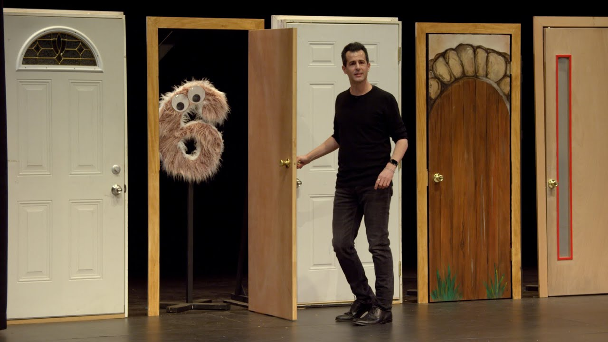

# Lecture: Algorithms

[Open in CS50 video player](https://video.cs50.io/gR6nycuZKlM?screen=CRl1MoW0F-E)

## Last week

*   We learned about tools to solve problems, or bugs, in our code. In particular, we discovered how to use a debugger, a tool that allows us to step slowly through our code and look at values in memory while our program is running.
*   Another powerful, if less technical, tool is rubber duck debugging, where we try to explain what we're trying to do to a rubber duck (or some other object), and in the process realize the problem (and hopefully solution!) on our own.
*   We looked at memory, visualizing bytes in a grid and storing values in each box, or byte, with variables and arrays.

## Searching

*   It turns out that, with arrays, a computer can't look at all of the elements at once. Instead, a computer can only to look at them one at a time, though the order can be arbitrary. (Recall in Week 0, David could only look at one page at a time in a phone book, whether he flipped through in order or in a more sophisticated way.)
*   **Searching** is how we solve the problem of finding a particular value. A simple case might have an input of some array of values, and the output might simply be a `bool`, whether or not a particular value is in the array.
*   Today we'll look at algorithms for searching. To discuss them, we'll consider **running time**, or how long an algorithm takes to run given some size of input.

### Big _O_

*   In week 0, we saw different types of algorithms and their running times: 
    *   Recall that the red line is searching linearly, one page at a time; the yellow line is searching two pages at a time; and the green line is searching logarithmically, dividing the problem in half each time.
    *   And these running times are for the worst case, or the case where the value takes the longest to find (on the last page, as opposed to the first page).
*   The more formal way to describe each of these running times is with **big _O_ notation**, which we can think of as "on the order of". For example, if our algorithm is linear search, it will take approximately _O_(_n_) steps, read as "big O of _n_" or "on the order of _n_". In fact, even an algorithm that looks at two items at a time and takes _n_/2 steps has _O_(_n_). This is because, as _n_ gets bigger and bigger, only the dominant factor, or largest term, _n_, matters. In the chart above, if we zoomed out and changed the units on our axes, we would see the red and yellow lines end up very close together.
*   A logarithmic running time is _O_(log _n_), no matter what the base is, since this is just an approximation of what fundamentally happens to running time if _n_ is very large.
*   There are some common running times:
    *   _O_(_n_2)
    *   _O_(_n_ log _n_)
    *   _O_(_n_)
        *   (searching one page at a time, in order)
    *   _O_(log _n_)
        *   (dividing the phone book in half each time)
    *   _O_(1)
        *   An algorithm that takes a **constant** number of steps, regardless of how big the problem is.
*   Computer scientists might also use big Ω, big Omega notation, which is the lower bound of number of steps for our algorithm. Big _O_ is the upper bound of number of steps, or the worst case.
*   And we have a similar set of the most common big Ω running times:
    *   Ω(_n_2)
    *   Ω(_n_ log _n_)
    *   Ω(_n_)
    *   Ω(log _n_)
    *   Ω(1)
        *   (searching in a phone book, since we might find our name on the first page we check)

### Linear search, binary search

*   On stage, we have a few prop doors, with numbers hidden behind them. Since a computer can only look at one element in an array at a time, we can only open one door at a time as well.
*   If we want to look for the number zero, for example, we would have to open one door at a time, and if we didn't know anything about the numbers behind the doors, the simplest algorithm would be going from left to right.
*   So, we might write pseudocode for **linear search** with:

        For i from 0 to n–1
            If number behind i'th door
                Return true
        Return false

    *   We label each of `n` doors from `0` to `n–1`, and check each of them in order.
    *   "Return false" is _outside_ the for loop, since we only want to do that after we've looked behind _all_ the doors.
    *   The big _O_ running time for this algorithm would be _O_(_n_), and the lower bound, big Omega, would be Ω(1).
*   If we know that the numbers behind the doors are sorted, then we can start in the middle, and find our value more efficiently.
*   For binary search, our algorithm might look like:

        If no doors
            Return false
        If number behind middle door
            Return true
        Else if number < middle door
            Search left half
        Else if number > middle door
            Search right half

    *   The upper bound for binary search is _O_(log _n_), and the lower bound also Ω(1), if the number we're looking for is in the middle, where we happen to start.
*   With 64 light bulbs, we notice that linear search takes much longer than binary search, which only takes a few steps.
*   We turned off the light bulbs at a frequency of one **hertz**, or cycle per second, and a processor's speed might be measured in gigahertz, or billions of operations per second.

### Searching with code

*   Let's take a look at `numbers.c`:

        #include <cs50.h>
        #include <stdio.h>

        int main(void)
        {
            int numbers[] = {4, 6, 8, 2, 7, 5, 0};

            for (int i = 0; i < 7; i++)
            {
                if (numbers[i] == 0)
                {
                    printf("Found\n");
                    return 0;
                }
            }
            printf("Not found\n");
            return 1;
        }

    *   Here we initialize an array with some values in curly braces, and we check the items in the array one at a time, in order, to see if they're equal to zero (what we were originally looking for behind the doors on stage).
    *   If we find the value of zero, we return an exit code of 0 (to indicate success). Otherwise, _after_ our for loop, we return 1 (to indicate failure).
*   We can do the same for names:

        #include <cs50.h>
        #include <stdio.h>
        #include <string.h>

        int main(void)
        {
            string names[] = {"Bill", "Charlie", "Fred", "George", "Ginny", "Percy", "Ron"};

            for (int i = 0; i < 7; i++)
            {
                if (strcmp(names[i], "Ron") == 0)
                {
                    printf("Found\n");
                    return 0;
                }
            }
            printf("Not found\n");
            return 1;
        }

    *   Note that `names` is a sorted array of strings.
    *   We can't compare strings directly in C, since they're not a simple data type but rather an array of many characters. Luckily, the `string` library has a `strcmp` ("string compare") function which compares strings for us, one character at a time, and returns `0` if they're the same.
    *   If we only check for `strcmp(names[i], "Ron")` and not `strcmp(names[i], "Ron") == 0`, then we'll print `Found` even if the name isn't found. This is because `strcmp` returns a value that isn't `0` if two strings _don't_ match, and any nonzero value is equivalent to true in a condition.

## Structs

*   If we wanted to implement a program that searches a phone book, we might want a data type for a "person", with their name and phone number.
*   It turns out in C that we can define our own data type, or data _structure_, with a **struct** in the following syntax:

        typedef struct
        {
            string name;
            string number;
        }
        person;

    *   We use `string` for the `number`, since we want to include symbols and formatting, like plus signs or hyphens.
    *   Our struct contains other data types inside it.
*   Let's try to implement our phone book without structs first:

        #include <cs50.h>
        #include <stdio.h>
        #include <string.h>

        int main(void)
        {
            string names[] = {"Brian", "David"};
            string numbers[] = {"+1-617-495-1000", "+1-949-468-2750"};

            for (int i = 0; i < 2; i++)
            {
                if (strcmp(names[i], "David") == 0)
                {
                    printf("Found %s\n", numbers[i]);
                    return 0;
                }
            }
            printf("Not found\n");
            return 1;
        }

    *   We'll need to be careful to make sure that the firstname in `names` matches the first number in `numbers`, and so on.
    *   If the name at a certain index `i` in the `names` array matches who we're looking for, we can return the phone number in the `numbers` array at the same index.
*   With structs, we can be a little more confident that we won't have human errors in our program:

        #include <cs50.h>
        #include <stdio.h>
        #include <string.h>

        typedef struct
        {
            string name;
            string number;
        }
        person;

        int main(void)
        {
            person people[2];

            people[0].name = "Brian";
            people[0].number = "+1-617-495-1000";

            people[1].name = "David";
            people[1].number = "+1-949-468-2750";

            for (int i = 0; i < 2; i++)
            {
                if (strcmp(people[i].name, "David") == 0)
                {
                    printf("Found %s\n", people[i].number);
                    return 0;
                }
            }
            printf("Not found\n");
            return 1;
        }

    *   We create an array of the `person` struct type, and name it `people` (as in `int numbers[]`, though we could name it arbitrarily, like any other variable). We set the values for each field, or variable, inside each `person` struct, using the dot operator, `.`.
    *   In our loop, we can now be more certain that the `number` corresponds to the `name` since they are from the same `person` struct.
    *   We can also improve the design of our program with a constant, like `const int NUMBER = 10;`, and store our values not in our code but in a separate file or even a database, which we'll soon see.
*   Soon too, we'll write our own header files with definitions for structs, so they can be shared across different files for our program.

## Sorting

*   If our input is an unsorted list of numbers, there are many algorithms we could use to produce an output of a sorted list, where all the elements are in order.
*   With a sorted list, we can use binary search for efficiency, but it might take more time to write a sorting algorithm for that efficiency, so sometimes we'll encounter the tradeoff of time it takes a human to write a program compared to the time it takes a computer to run some algorithm. Other tradeoffs we'll see might be time and complexity, or time and memory usage.

### Selection sort

*   Brian is backstage with a set of numbers on a shelf, in unsorted order:

        6 3 8 5 2 7 4 1

*   Taking some numbers and moving them to their right place, Brian sorts the numbers pretty quickly.
*   Going step-by-step, Brian looks at each number in the list, remembering the smallest one we've seen so far. He gets to the end, and sees that 1 is the smallest, and he knows that must go at the beginning, so he'll just swap it with the number at the beginning, 6:

        6 3 8 5 2 7 4 1
        –             –
        1 3 8 5 2 7 4 6

*   Now Brian knows at least the first number is in the right place, so he can look for the smallest number among the rest, and swap it with the next unsorted number (now the second number):

        1 3 8 5 2 7 4 6
          –     –
        1 2 8 5 3 7 4 6

*   And he repeats this again, swapping the next smallest, 3, with the 8:

        1 2 8 5 3 7 4 6
            -   -
        1 2 3 5 8 7 4 6

*   After a few more swaps, we end up with a sorted list.
*   This algorithm is called **selection sort**, and we can be a bit more specific with some pseudocode:

        For i from 0 to n–1
            Find smallest item between i'th item and last item
            Swap smallest item with i'th item

    *   The first step in the loop is to look for the smallest item in the unsorted part of the list, which will be between the i'th item and last item, since we know we've sorted up to the "i-1'th" item.
    *   Then, we swap the smallest item with the i'th item, which makes everything up to the item at i sorted.
*   We look at a [visualization online](https://www.cs.usfca.edu/~galles/visualization/ComparisonSort.html) with animations for how the elements move for insertion sort.
*   For this algorithm, we were looking at roughly all _n_ elements to find the smallest, and making _n_ passes to sort all the elements.
*   More formally, we can use some math formulas to show that the biggest factor is indeed _n_2. We started with having to look at all _n_ elements, then only _n_ - 1, then _n_ - 2:

        n + (n – 1) + (n – 2) + ... + 1
        n(n + 1)/2
        (n^2 + n)/2
        n^2/2 + n/2
        O(n^2)

    *   Since _n_2 is the biggest, or dominant, factor, we can say that the algorithm has running time of _O_(_n_2).

### Bubble sort

*   We can try a different algorithm, one where we swap pairs of numbers repeatedly, called **bubble sort**.
*   Brian will look at the first two numbers, and swap them so they are in order:

        6 3 8 5 2 7 4 1
        – –
        3 6 8 5 2 7 4 1

*   The next pair, `6` and `8`, are in order, so we don't need to swap them.
*   The next pair, `8` and `5`, need to be swapped:

        3 6 8 5 2 7 4 1
            – –
        3 6 5 8 2 7 4 1

*   Brian continues until he reaches the end of the list:

        3 6 5 2 8 7 4 1
                – –
        3 6 5 2 7 8 4 1
                  – –
        3 6 5 2 7 4 8 1
                    – –
        3 6 5 2 7 4 1 8
                      -

*   Our list isn't sorted yet, but we're slightly closer to the solution because the biggest value, `8`, has been shifted all the way to the right. And other bigger numbers have also moved to the right, or "bubbled up".
*   Brian will make another pass through the list:

        3 6 5 2 7 4 1 8
        – –
        3 6 5 2 7 4 1 8
          – –
        3 5 6 2 7 4 1 8
            – –
        3 5 2 6 7 4 1 8
              – –
        3 5 2 6 7 4 1 8
                – –
        3 5 2 6 4 7 1 8
                  - –
        3 5 2 6 4 1 7 8
                    - -

    *   Note that we didn't need to swap the 3 and 6, or the 6 and 7.
    *   But now, the next biggest value, `7`, moved all the way to the right.
*   Brian will repeat this process a few more times, and more and more of the list becomes sorted, until we have a fully sorted list.
*   With selection sort, the best case with a sorted list would still take just as many steps as the worst case, since we only check for the smallest number with each pass.
*   The pseudocode for bubble sort might look like:

        Repeat until sorted
            For i from 0 to n–2
                If i'th and i+1'th elements out of order
                    Swap them

    *   Since we are comparing the `i'th` and `i+1'th` element, we only need to go up to _n_ – 2 for `i`. Then, we swap the two elements if they're out of order.
    *   And we can stop as soon as the list is sorted, since we can just remember whether we made any swaps. If not, the list must be sorted already.
*   To determine the running time for bubble sort, we have _n_ – 1 comparisons in the loop, and at most _n_ – 1 loops, so we get _n_2 – 2_n_ + 2 steps total. But the largest factor, or dominant term, is again _n_2 as `n` gets larger and larger, so we can say that bubble sort has _O_(_n_2). So it turns out that fundamentally, insertion sort and bubble sort has the same upper bound for running time.
*   The lower bound for running time here would be Ω(_n_), once we look at all the elements once.
*   So our upper bounds for running time that we've seen are:
    *   _O_(_n_2)
        *   selection sort, bubble sort
    *   _O_(_n_ log _n_)
    *   _O_(_n_)
        *   linear search
    *   _O_(log _n_)
        *   binary search
    *   _O_(1)
*   And for lower bounds:
    *   Ω(_n_2)
        *   selection sort
    *   Ω(_n_ log _n_)
    *   Ω(_n_)
        *   bubble sort
    *   Ω(log _n_)
    *   Ω(1)
        *   linear search, binary search

## Recursion

*   **Recursion** is the ability for a function to call itself. We haven't seen this in code yet, but we've seen something in pseudocode in week 0 that we might be able to convert:

        1  Pick up phone book
        2  Open to middle of phone book
        3  Look at page
        4  If Smith is on page
        5      Call Mike
        6  Else if Smith is earlier in book
        7      Open to middle of left half of book
        8      **Go back to line 3**
        9  Else if Smith is later in book
        10     Open to middle of right half of book
        11     **Go back to line 3**
        12 Else
        13     Quit

    *   Here, we're using a loop-like instruction to go back to a particular line.
*   We could instead just repeat our entire algorithm on the half of the book we have left:

        1  Pick up phone book
        2  Open to middle of phone book
        3  Look at page
        4  If Smith is on page
        5      Call Mike
        6  Else if Smith is earlier in book
        7      **Search left half of book**
        8
        9  Else if Smith is later in book
        10     **Search right half of book**
        11
        12 Else
        13     Quit

    *   This seems like a cyclical process that will never end, but we're actually changing the input to the function and dividing the problem in half each time, stopping once there's no more book left.
*   In week 1, too, we implemented a "pyramid" of blocks in the following shape:

        #
        ##
        ###
        ####

*   But notice that a pyramid of height 4 is actually a pyramid of height 3, with an extra row of 4 blocks added on. And a pyramid of height 3 is a pyramid of height 2, with an extra row of 3 blocks. A pyramid of height 2 is a pyramid of height 1, with an extra row of 2 blocks. And finally, a pyramid of height 1 is just a single block.
*   With this idea in mind, we can write a recursive function to draw a pyramid, a function that calls itself to draw a smaller pyramid before adding another row.

## Merge sort

*   We can take the idea of recusion to sorting, with another algorithm called **merge sort**. The pseudocode might look like:

        If only one number
          Return
        Else
            Sort left half of number
            Sort right half of number
            Merge sorted halves

*   We'll best see this in practice with two sorted lists:

        3 5 6 8 | 1 2 4 7

*   We'll _merge_ the two lists for a final sorted list by taking the smallest element at the front of each list, one at a time:

        3 5 6 8 | _ 2 4 7

        1

*   The 1 on the right side is the smallest between 1 and 3, so we can start our sorted list with it.

        3 5 6 8 | _ _ 4 7

        1 2

*   The next smallest number, between 2 and 3, is 2, so we use the 2.

        _ 5 6 8 | _ _ 4 7

        1 2 3

        _ 5 6 8 | _ _ _ 7

        1 2 3 4

        _ _ 6 8 | _ _ _ 7

        1 2 3 4 5

        _ _ _ 8 | _ _ _ 7

        1 2 3 4 5 6

        _ _ _ 8 | _ _ _ _

        1 2 3 4 5 6 7

        _ _ _ _ | _ _ _ _

        1 2 3 4 5 6 7 8

    *   Now we have a completely sorted list.
*   We've seen how the final line in our pseudocode can be implemented, and now we'll see how the entire algorithm works:

        If only one number
          Return
        Else
            Sort left half of number
            Sort right half of number
            Merge sorted halves

*   We start with another unsorted list:

        6 3 8 5 2 7 4 1

*   To start, we need to sort the left half first:

        6 3 8 5

*   Well, to sort that, we need to sort the left half of the left half first:

        6 3

*   Now both of these halves just have one item each, so they're both sorted. We merge these two lists together, for a sorted list:

        _ _ 8 5 2 7 4 1
        3 6

*   We're back to sorting the right half of the left half, merging them together:

        _ _ _ _ 2 7 4 1
        3 6 5 8

*   Both halves of the _left half_ have been sorted individually, so now we need to merge them together:

        _ _ _ _ 2 7 4 1
        _ _ _ _
        3 5 6 8

*   We'll do what we just did, with the right half:

        _ _ _ _ _ _ _ _
        _ _ _ _ 2 7 1 4
        3 5 6 8

    *   First, we sort both halves of the right half.

            _ _ _ _ _ _ _ _
            _ _ _ _ _ _ _ _
            3 5 6 8 1 2 4 7

    *   Then, we merge them together for a sorted right half.
*   Finally, we have two sorted halves again, and we can merge them for a fully sorted list:

        _ _ _ _ _ _ _ _
        _ _ _ _ _ _ _ _
        _ _ _ _ _ _ _ _
        1 2 3 4 5 6 7 8

*   Each number was moved from one shelf to another three times (since the list was divided from 8, to 4, to 2, and to 1 before merged back together into sorted lists of 2, 4, and finally 8 again). And each shelf required all 8 numbers to be merged together, one at a time.
*   Each shelf required _n_ steps, and there were only log _n_ shelves needed, so we multiply those factors together. Our total running time for binary search is _O_(_n_ log _n_):
    *   _O_(_n_2)
        *   selection sort, bubble sort
    *   _O_(_n_ log _n_)
        *   merge sort
    *   _O_(_n_)
        *   linear search
    *   _O_(log _n_)
        *   binary search
    *   _O_(1)
*   (Since log _n_ is greater than 1 but less than _n_, _n_ log _n_ is in between _n_ (times 1) and _n_2.)
*   The best case, Ω, is still _n_ log _n_, since we still have to sort each half first and then merge them together:
    *   Ω(_n_2)
        *   selection sort
    *   Ω(_n_ log _n_)
        *   merge sort
    *   Ω(_n_)
        *   bubble sort
    *   Ω(log _n_)
    *   Ω(1)
        *   linear search, binary search
*   Even though merge sort is likely to be faster than selection sort or bubble sort, we did need another shelf, or more memory, to temporarily store our merged lists at each stage. We face the tradeoff of incurring a higher cost, another array in memory, for the benefit of faster sorting.
*   Finally, there is another notation, Θ, Theta, which we use to describe running times of algorithms if the upper bound and lower bound is the same. For example, merge sort has Θ(_n_ log _n_) since the best and worst case both require the same number of steps. And selection sort has Θ(_n_2):
    *   Θ(_n_2)
        *   selection sort
    *   Θ(_n_ log _n_)
        *   merge sort
    *   Θ(_n_)
    *   Θ(log _n_)
    *   Θ(1)
*   We look at a [final visualization](https://www.youtube.com/watch?v=ZZuD6iUe3Pc) of sorting algorithms with a larger number of inputs, running at the same time.

