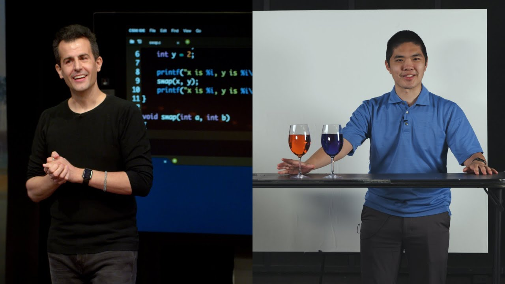

# Lecture: Memory

[Open in CS50 video player](https://video.cs50.io/NKTfNv2T0FE?screen=7y81o-2rjeM)

## Hexadecimal

*   In week 2, we talked about memory and how each byte has an address, or identifier, so we can refer to where our data are actually stored.
*   It turns out that, by convention, the addresses for memory use the counting system **hexadecimal**, or base-16, where there are 16 digits: 0-9, and A-F as equivalents to 10-15.
*   Let's consider a two-digit hexadecimal number:

        16^1 16^0
           0    A

    *   Here, the A in the ones place (since 16^0 = 1) has a decimal value of 10\. We can keep counting until `0F`, which is equivalent to 15 in decimal.
*   After `0F`, we need to carry the one, as we would go from 09 to 10 in decimal:

        16^1 16^0
           1    0

    *   Here, the `1` has a value of 16^1 * 1 = 16, so `10` in hexadecimal is 16 in decimal.
*   With two digits, we can have a maximum value of `FF`, or 16^1 * 15 + 16^0 * 15 = 240 + 15 = 255, which is the same maximum value with 8 bits of binary. So two digits in hexadecimal can conveniently represent the value of a byte in binary. (Each digit in hexadecimal, with 16 values, maps to four bits in binary.)
*   In writing, we indicate a value is in hexadecimal by prefixing it with `0x`, as in `0x10`, where the value is equal to 16 in decimal, as opposed to 10.
*   The RGB color system conventionally uses hexadecimal to describe the amount of each color. For example, `000000` in hexadecimal represents 0 for each of red, green, and blue, for a combined color of black. And `FF0000` would be 255, or the highest possible, amount of red. `FFFFFF` would indicate the highest value of each color, combining to be the brightest white. With different values for each color, we can represent millions of different colors.
*   For our computer's memory, too, we'll use hexadecimal for each address or location.

## Addresses

*   We might create a value `n`, and print it out:

        #include <stdio.h>

        int main(void)
        {
            int n = 50;
            printf("%i\n", n);
        }

*   In our computer's memory, there are now 4 bytes somewhere that have the binary value of 50, labeled `n`:  
    
*   It turns out that, with the billions of bytes in memory, those bytes for the variable `n` starts at some location, which might look something like `0x12345678`.
*   In C, we can actually see the address with the `&` operator, which means "get the address of this variable":

        #include <stdio.h>

        int main(void)
        {
            int n = 50;
            printf("%p\n", &n);
        }

    *   `%p` is the format code for an address.
    *   In the CS50 IDE, we see an address like `0x7ffd80792f7c`. The value of the address in itself is not useful, since it's just some location in memory that the variable is stored in; instead, the important idea is that we can _use_ this address later.
*   The `*` operator, or the dereference operator, lets us "go to" the location that a pointer is pointing to.
*   For example, we can print `*&n`, where we "go to" the address of `n`, and that will print out the value of `n`, `50`, since that's the value at the address of `n`:

        #include <stdio.h>

        int main(void)
        {
            int n = 50;
            printf("%i\n", *&n);
        }

## Pointers

*   A variable that stores an address is called a **pointer**, which we can think of as a value that "points" to a location in memory. In C, pointers can refer to specific types of values.
*   We can use the `*` operator (in an unfortunately confusing way) to declare a variable that we want to be a pointer:

        #include <stdio.h>

        int main(void)
        {
           int n = 50;
           int *p = &n;
           printf("%p\n", p);
        }

    *   Here, we use `int *p` to declare a variable, `p`, that has the type of `*`, a pointer, to a value of type `int`, an integer. Then, we can print its value (an address, something like `0x12345678`), or print the _value at_ its location with `printf("%i\n", *p);`.
*   In our computer's memory, the variables will look like this:  
    
    *   Since `p` is a variable itself, it's somewhere in memory, and the value stored there is the address of `n`.
    *   Modern computer systems are "64-bit", meaning that they use 64 bits to address memory, so a pointer will in reality be 8 bytes, twice as big as an integer of 4 bytes.
*   We can abstract away the actual value of the addresses, since they'll be different as we declare variables in our programs and not very useful, and simply think of `p` as "pointing at" some value:  
    
*   In the real world, we might have a mailbox labeled "p", among many mailboxes with addresses. Inside our mailbox, we can put a value like `0x123`, which is the address of some other mailbox `n`, with the address `0x123`.

## Strings

*   A variable declared with `string s = "HI!";` will be stored one character at a time in memory. And we can access each character with `s[0]`, `s[1]`, `s[2]`, and `s[3]`:  
    ![boxes side by side, containing: H labeled s[0], I labeled s[1], ! labeled s[2], \0 labeled s[3]](s_array.png)
*   But it turns out that each character, since it's stored in memory, _also_ has some unique address, and `s` is actually just a pointer with the address of the first character:  
    
*   And the variable `s` stores the address of the first character of the string. The value `\0` is the only indicator of the end of the string:  
    
    *   Since the rest of the characters are in an array, back-to-back, we can start at the address in `s` and continue reading one character at a time from memory until we reach `\0`.
*   Let's print out a string:

        #include <cs50.h>
        #include <stdio.h>

        int main(void)
        {
            string s = "HI!";
            printf("%s\n", s);
        }

*   We can see the value stored in `s` with `printf("%p\n", s);`, and we see something like `0x4006a4` since we're printing the address in memory of the first character of the string.
*   If we add another line, `printf("%p\n", &s[1]);`, we indeed see the next address in memory: `0x4006a5`.
*   It turns out that `string s` is just a pointer, an address to some character in memory.
*   In fact, the CS50 library defines a type that doesn't exist in C, `string`, as `char *`, with `typedef char *string;`. The custom type, `string`, is defined as just a `char *` with `typedef`. So `string s = "HI!"` is the same as `char *s = "HI!";`. And we can use strings in C in the exact same way without the CS50 library, by using `char *`.

## Pointer arithmetic

*   **Pointer arithmetic** is mathematical operations on addresses with pointers.
*   We can print out each character in a string (using `char *` directly):

        #include <stdio.h>

        int main(void)
        {
            char *s = "HI!";
            printf("%c\n", s[0]);
            printf("%c\n", s[1]);
            printf("%c\n", s[2]);
        }

*   But we can go to addresses directly:

        #include <stdio.h>

        int main(void)
        {
            char *s = "HI!";
            printf("%c\n", *s);
            printf("%c\n", *(s+1));
            printf("%c\n", *(s+2));
        }

    *   `*s` goes to the address stored in `s`, and `*(s+1)` goes to the location in memory with an address one byte higher, or the next character. `s[1]` is syntactic sugar for `*(s+1)`, equivalent in function but more human-friendly to read and write.
*   We can even try to go to addresses in memory that we shouldn't, like with `*(s+10000)`, and when we run our program, we'll get a **segmentation fault**, or crash as a result of our program touching memory in a segment it shouldn't have.

## Compare and copy

*   Let's try to compare two integers from the user:

        #include <cs50.h>
        #include <stdio.h>

        int main(void)
        {
            int i = get_int("i: ");
            int j = get_int("j: ");

            if (i == j)
            {
                printf("Same\n");
            }
            else
            {
                printf("Different\n");
            }
        }

    *   We compile and run our program, and it works as we'd expect, with the same values of the two integers giving us "Same" and different values "Different".
*   When we try to compare two strings, we see that the same inputs are causing our program to print "Different":

        #include <cs50.h>
        #include <stdio.h>

        int main(void)
        {
            char *s = get_string("s: ");
            char *t = get_string("t: ");

            if (s == t)
            {
                printf("Same\n");
            }
            else
            {
                printf("Different\n");
            }
        }

    *   Even when our inputs are the same, we see "Different" printed.
    *   Each "string" is a pointer, `char *`, to a different location in memory, where the first character of each string is stored. So even if the characters in the string are the same, this will always print "Different".
*   For example, our first string might be at address 0x123, our second might be at 0x456, and `s` will have the value of `0x123`, pointing at that location, and `t` will have the value of `0x456`, pointing at another location:  
    
*   And `get_string`, this whole time, has been returning just a `char *`, or a pointer to the first character of a string from the user. Since we called `get_string` twice, we got two different pointers back.
*   Let's try to copy a string:

        #include <cs50.h>
        #include <ctype.h>
        #include <stdio.h>

        int main(void)
        {
            char *s = get_string("s: ");

            char *t = s;

            t[0] = toupper(t[0]);

            printf("s: %s\n", s);
            printf("t: %s\n", t);
        }

    *   We get a string `s`, and copy the value of `s` into `t`. Then, we capitalize the first letter in `t`.
    *   But when we run our program, we see that both `s` and `t` are now capitalized.
    *   Since we set `s` and `t` to the same value, or the same address, they're both pointing to the same character, and so we capitalized the same character in memory!
*   To actually make a copy of a string, we have to do a little more work, and copy each character in `s` to somewhere else in memory:

        #include <cs50.h>
        #include <ctype.h>
        #include <stdio.h>
        #include <stdlib.h>
        #include <string.h>

        int main(void)
        {
            char *s = get_string("s: ");

            char *t = malloc(strlen(s) + 1);

            for (int i = 0, n = strlen(s); i < n + 1; i++)
            {
                t[i] = s[i];
            }

            t[0] = toupper(t[0]);

            printf("s: %s\n", s);
            printf("t: %s\n", t);
        }

    *   We create a new variable, `t`, of the type `char *`, with `char *t`. Now, we want to point it to a new chunk of memory that's large enough to store the copy of the string. With **`malloc`**, we _allocate_ some number of bytes in memory (that aren't already used to store other values), and we pass in the number of bytes we'd like to mark for use. We already know the length of `s`, and we add 1 to that for the terminating null character. So, our final line of code is `char *t = malloc(strlen(s) + 1);`.
    *   Then, we copy each character, one at a time, with a `for` loop. We use `i < n + 1`, since we actually want to go _up to_ `n`, the length of the string, to ensure we copy the terminating character in the string. In the loop, we set `t[i] = s[i]`, copying the characters. While we could use `*(t+i) = *(s+i)` to the same effect, it's arguably less readable.
    *   Now, we can capitalize just the first letter of `t`.
*   We can add some error-checking to our program:

        #include <cs50.h>
        #include <ctype.h>
        #include <stdio.h>
        #include <stdlib.h>
        #include <string.h>

        int main(void)
        {
            char *s = get_string("s: ");

            char *t = malloc(strlen(s) + 1);
            if (t == NULL)
            {
                return 1;
            }

            for (int i = 0, n = strlen(s); i < n + 1; i++)
            {
                t[i] = s[i];
            }

            if (strlen(t) > 0)
            {
                t[0] = toupper(t[0]);
            }

            printf("s: %s\n", s);
            printf("t: %s\n", t);

            free(t);
        }

    *   If our computer is out of memory, `malloc` will return `NULL`, the null pointer, or a special value that indicates there isn't an address to point to. So we should check for that case, and exit if `t` is `NULL`.
    *   We could also check that `t` has a length, before trying to capitalize the first character.
    *   Finally, we should **free** the memory we allocated earlier, which marks it as usable again by some other program. We call the `free` function and pass in the pointer `t`, since we're done with that chunk of memory. (`get_string`, too, calls `malloc` to allocate memory for strings, and calls `free` just before the `main` function returns.)
*   We can actually also use the `strcpy` function, from the C's string library, with `strcpy(t, s);` instead of our loop, to copy the string `s` into `t`.

## valgrind

*   `valgrind` is a command-line tool that we can use to run our program and see if it has any **memory leaks**, or memory we've allocated without freeing, which might eventually cause out computer to run out of memory.
*   Let's build a string but allocate less than what we need in `memory.c`:

        #include <stdio.h>
        #include <stdlib.h>

        int main(void)
        {
            char *s = malloc(3);
            s[0] = 'H';
            s[1] = 'I';
            s[2] = '!';
            s[3] = '\0';
            printf("%s\n", s);
        }

    *   We also don't free the memory we've allocated.
    *   We'll run `valgrind ./memory` after compiling, and we'll see a lot of output, but we can run `help50 valgrind ./memory` to help explain some of those messages. For this program, we see snippets like "Invalid write of size 1", "Invalid read of size 1", and finally "3 bytes in 1 blocks are definitely lost", with line numbers nearby. Indeed, we're writing to memory, `s[3]`, which is not part of what we originally allocated for `s`. And when we print out `s`, we're reading all the way to `s[3]` as well. And finally, `s` isn't freed at the end of our program.
*   We can make sure to allocate the right number of bytes, and free memory at the end:

        #include <stdio.h>
        #include <stdlib.h>

        int main(void)
        {
            char *s = malloc(4);
            s[0] = 'H';
            s[1] = 'I';
            s[2] = '!';
            s[3] = '\0';
            printf("%s\n", s);
            free(s);
        }

    *   Now, `valgrind` doesn't show any warning messages.

## Garbage values

*   Let's take a look at the following:

        int main(void)
        {
            int *x;
            int *y;

            x = malloc(sizeof(int));

            *x = 42;
            *y = 13;

            y = x;

            *y = 13;
        }

    *   We declare two pointers to integers, `x` and `y`, but don't assign them values. We use `malloc` to allocate enough memory for an integer with `sizeof(int)`, and store it in `x`. `*x = 42` goes to the address `x` points to, and sets that location in memory to the value 42.
    *   With `*y = 13`, we're trying to put the value 13 at the address `y` points to. But since we never assigned `y` a value, it has a **garbage value**, or whatever unknown value that was in memory, from whatever program was running in our computer before. So when we try to go to the garbage value in `y` as an address, we're going to some unknown address, which is likely to cause a segmentation fault, or segfault.
*   We watch [Pointer Fun with Binky](https://www.youtube.com/watch?v=3uLKjb973HU), an animated video demonstrating the concepts in the code above.
*   We can print out garbage values, by declaring an array but not setting any of its values:

        #include <stdio.h>

        int main(void)
        {
            int scores[3];
            for (int i = 0; i < 3; i++)
            {
                printf("%i\n", scores[i]);
            }
        }

    *   When we compile and run this program, we see various values printed.

## Swap

*   Let's try to swap the values of two integers.

        #include <stdio.h>

        void swap(int a, int b);

        int main(void)
        {
            int x = 1;
            int y = 2;

            printf("x is %i, y is %i\n", x, y);
            swap(x, y);
            printf("x is %i, y is %i\n", x, y);
        }

        void swap(int a, int b)
        {
            int tmp = a;
            a = b;
            b = tmp;
        }

    *   In the real world, if we had a red liquid in one glass, and a blue liquid in another, and we wanted to swap them, we would need a third glass to temporarily hold one of the liquids, perhaps the red glass. Then we can pour the blue liquid into the first glass, and finally the red liquid from the temporary glass into the second one.
    *   In our `swap` function, we have a third variable to use as temporary storage space as well. We put `a` into `tmp`, and then set `a` to the value of `b`, and finally `b` can be changed to the original value of `a`, now in `tmp`.
*   But, if we tried to use that function in a program, we don't see any changes. It turns out that the `swap` function gets its own variables, `a` and `b` when they are passed in, that are copies of `x` and `y`, and so changing those values don't change `x` and `y` in the `main` function.

## Memory layout

*   Within our computer's memory, the different types of data that need to be stored for our program are organized into different sections:  
    
    *   The **machine code** section is our compiled program's binary code. When we run our program, that code is loaded into the "top" of memory.
    *   Just below, or in the next part of memory, are **global variables** we declare in our program.
    *   The **heap** section is an empty area from where `malloc` can get free memory for our program to use. As we call `malloc`, we start allocating memory from the top down.
    *   The **stack** section is used by functions in our program as they are called, and grows upwards. For example, our `main` function is at the very bottom of the stack and has the local variables `x` and `y`. The `swap` function, when it's called, has its own area of memory that's on top of `main`'s, with the local variables `a`, `b`, and `tmp`:  
        
*   Once the function `swap` returns, the memory it was using is freed for the next function call. `x` and `y` are arguments, so they're copied as `a` and `b` for `swap`, so we don't see our changes back in `main`.
*   By passing in the address of `x` and `y`, our `swap` function can actually work:

        #include <stdio.h>

        void swap(int *a, int *b);

        int main(void)
        {
            int x = 1;
            int y = 2;

            printf("x is %i, y is %i\n", x, y);
            swap(&x, &y);
            printf("x is %i, y is %i\n", x, y);
        }

        void swap(int *a, int *b)
        {
            int tmp = *a;
            *a = *b;
            *b = tmp;
        }

    *   The addresses of `x` and `y` are passed in from `main` to `swap` with `&x` and `&y`, and we use the `int *a` syntax to declare that our `swap` function takes in pointers. We save the value of `x` to `tmp` by following the pointer `a`, and then take the value of `y` by following the pointer `b`, and store that to the location `a` is pointing to (`x`). Finally, we store the value of `tmp` to the location pointed to by `b` (`y`), and we're done:  
        
*   If we call `malloc` for too much memory, we will have a **heap overflow**, since we end up going past our heap. Or, if we call too many functions without returning from them, we will have a **stack overflow**, where our stack has too much memory allocated as well.
*   Let's implement drawing Mario's pyramid, by calling a function:

        #include <cs50.h>
        #include <stdio.h>

        void draw(int h);

        int main(void)
        {
            int height = get_int("Height: ");
            draw(height);
        }

        void draw(int h)
        {
            for (int i = 1; i <= h; i++)
            {
                for (int j = 1; j <= i; j++)
                {
                    printf("#");
                }
                printf("\n");
            }
        }

*   We can change `draw` to be recursive:

        void draw(int h)
        {
            draw(h - 1);

            for (int i = 0; i < h; i++)
            {
                printf("#");
            }
            printf("\n");
        }

    *   When we try to compile this with `make`, we see a warning that the `draw` function will call itself recursively without stopping. So we'll use `clang` without the extra checks, and when we run this program, we get a segmentation fault right away. `draw` is calling itself over and over, and we ran out of memory on the stack.
*   By adding a base case, the `draw` function will stop calling itself at some point:

        void draw(int h)
        {
            if (h == 0)
            {
                return;
            }

            draw(h - 1);

            for (int i = 0; i < h; i++)
            {
                printf("#");
            }
            printf("\n");
        }

    *   But if we enter a large enough value for the height, like `2000000000`, we'll still run out of memory, since we're calling `draw` too many times without returning.
*   A **buffer overflow** occurs when we go past the end of a buffer, some chunk of memory we've allocated like an array, and access memory we shouldn't be.

## scanf

*   We can implement `get_int` ourselves with a C library function, `scanf`:

        #include <stdio.h>

        int main(void)
        {
            int x;
            printf("x: ");
            scanf("%i", &x);
            printf("x: %i\n", x);
        }

    *   `scanf` takes a format, `%i`, so the input is "scanned" for that format. We also pass in the address in memory where we want that input to go. But `scanf` doesn't have much error checking, so we might not get an integer.
*   We can try to get a string the same way:

        #include <stdio.h>

        int main(void)
        {
            char *s;
            printf("s: ");
            scanf("%s", s);
            printf("s: %s\n", s);
        }

    *   But we haven't actually allocated any memory for `s`, so we need to call `malloc` to allocate memory for characters for our string. We could also use `char s[4];` to declare an array of four characters. Then, `s` will be treated as a pointer to the first character in `scanf` and `printf`.
    *   Now, if the user types in a string of length 3 or less, our program will work safely. But if the user types in a longer string, `scanf` might be trying to write past the end of our array into unknown memory, causing our program to crash.
    *   `get_string` from the CS50 library continuously allocates more memory as `scanf` reads in more characters, so it doesn't have that issue.

## Files

*   With the ability to use pointers, we can also open files, like a digital phone book:

        #include <cs50.h>
        #include <stdio.h>
        #include <string.h>

        int main(void)
        {
            FILE *file = fopen("phonebook.csv", "a");
            if (file == NULL)
            {
                return 1;
            }

            char *name = get_string("Name: ");
            char *number = get_string("Number: ");

            fprintf(file, "%s,%s\n", name, number);

            fclose(file);
        }

    *   `fopen` is a new function we can use to open a file. It will return a pointer to a new type, `FILE`, that we can read from and write to. The first argument is the name of the file, and the second argument is the mode we want to open the file in (`r` for read, `w` for write, and `a` for append, or adding to).
    *   We'll add a check to exit if we couldn't open the file for some reason.
    *   After we get some strings, we can use `fprintf` to print to a file.
    *   Finally, we close the file with `fclose`.
*   Now we can create our own CSV files, a file of comma-separated values (like a mini-spreadsheet), programmatically.

# [Graphics](#graphics)

*   We can read in binary and map them to pixels and colors, to display images and videos. With a finite number of bits in an image file, though, we can only zoom in so far before we start seeing individual pixels.
    *   With artificial intelligence and machine learning, however, we can use algorithms that can generate additional details that weren't there before, by guessing based on other data.
*   Let's look at a program that opens a file and tells us if it's a JPEG file, an image file in a particular format:

        #include <stdint.h>
        #include <stdio.h>

        typedef uint8_t BYTE;

        int main(int argc, char *argv[])
        {
            // Check usage
            if (argc != 2)
            {
                return 1;
            }

            // Open file
            FILE *file = fopen(argv[1], "r");
            if (!file)
            {
                return 1;
            }

            // Read first three bytes
            BYTE bytes[3];
            fread(bytes, sizeof(BYTE), 3, file);

            // Check first three bytes
            if (bytes[0] == 0xff && bytes[1] == 0xd8 && bytes[2] == 0xff)
            {
                printf("Maybe\n");
            }
            else
            {
                printf("No\n");
            }

            // Close file
            fclose(file);
        }

    *   First, we define a `BYTE` as 8 bits, so we can refer to a byte as a type more easily in C.
    *   Then, we try to open a file (checking that we indeed get a non-NULL file back), and read the first three bytes from the file with `fread`, into a buffer called `bytes`.
    *   We can compare the first three bytes (in hexadecimal) to the three bytes required to begin a JPEG file. If they're the same, then our file is likely to be a JPEG file (though, other types of files may still begin with those bytes). But if they're not the same, we know it's definitely not a JPEG file.
*   We can even copy files ourselves, one byte at a time now:

        #include <stdint.h>
        #include <stdio.h>
        #include <stdlib.h>

        typedef uint8_t BYTE;

        int main(int argc, char *argv[])
        {
            // Ensure proper usage
            if (argc != 3)
            {
                fprintf(stderr, "Usage: copy SOURCE DESTINATION\n");
                return 1;
            }

            // open input file
            FILE *source = fopen(argv[1], "r");
            if (source == NULL)
            {
                printf("Could not open %s.\n", argv[1]);
                return 1;
            }

            // Open output file
            FILE *destination = fopen(argv[2], "w");
            if (destination == NULL)
            {
                fclose(source);
                printf("Could not create %s.\n", argv[2]);
                return 1;
            }

            // Copy source to destination, one BYTE at a time
            BYTE buffer;
            while (fread(&buffer, sizeof(BYTE), 1, source))
            {
                fwrite(&buffer, sizeof(BYTE), 1, destination);
            }

            // Close files
            fclose(source);
            fclose(destination);
            return 0;
        }

    *   We use `argv` to get arguments, using them as filenames to open files to read from and one to write to.
    *   Then, we read one byte from the `source` file into a buffer, and write that byte to the `destination` file. We can use a `while` loop to call `fread`, which will stop once there are no more bytes to read.
*   We can use these abilities to read and write files, recovering images from a file, and adding filters to images by changing the bytes in them, in this week's problem set!
