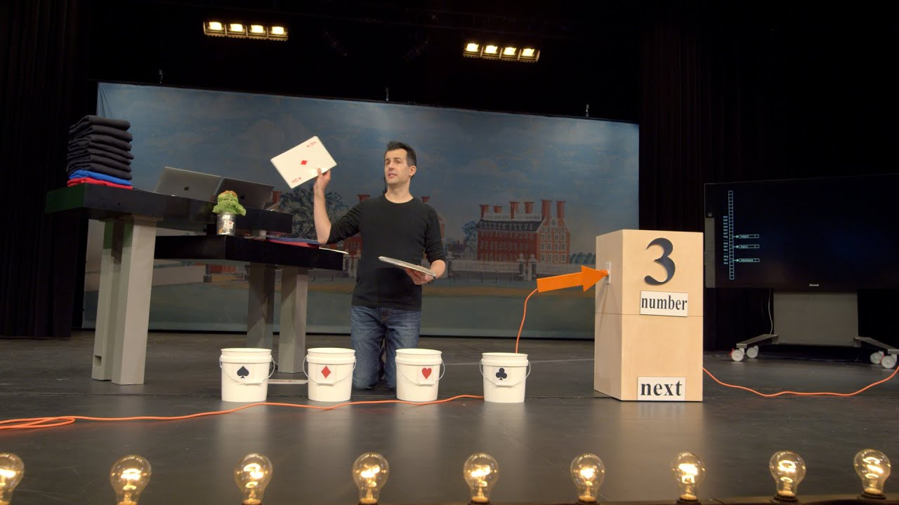

# Lecture: Data Structures

[Open in CS50 video player](https://video.cs50.io/2T-A_GFuoTo?screen=QdhPqzoTyUE)

## Resizing arrays

*   Last time, we learned about pointers, `malloc`, and other useful tools for working with memory.
*   In week 2, we learned about arrays, where we could store the same kind of value in a list, back-to-back in memory. When we need to insert an element, we need to increase the size of the array as well. But, the memory after it in our computer might already be used for some other data, like a string:  
    
*   One solution might be to allocate more memory where there's enough space, and move our array there. But we'll need to copy our array there, which becomes an operation with running time of _O_(_n_), since we need to copy each of the original _n_ elements first:  
    
    *   The lower bound of inserting an element into an array would be O(1) since we might already have space in the array for it.

## Data structures

*   **Data structures** are more complex ways to organize data in memory, allowing us to store information in different layouts.
*   To build a data structure, we'll need some tools:
    *   `struct` to create custom data types
    *   `.` to access properties in a structure
    *   `*` to go to an address in memory pointed to by a pointer
    *   `->` to access properties in a structure pointed to by a pointer

## Linked Lists

*   With a **linked list**, we can store a list of values that can easily be grown by storing values in different parts of memory:  
    
    *   We have the values `1`, `2`, and `3`, each at some address in memory like `0x123`, `0x456`, and `0x789`.
    *   This is different than an array since our values are no longer next to one another in memory. We can use whatever locations in memory that are free.
*   To track all of these values, we need link our list together by allocating, for each element, enough memory for both the value we want to store, and the address of the next element:  
    
    *   Next to our value of `1`, for example, we also store a pointer, `0x456`, to the next value. We'll call this a **node**, a component of our data structure that stores both a value and a pointer. In C, we'll implement our nodes with a struct.
    *   For our last node with value `3`, we have the null pointer, since there's no next element. When we need to insert another node, we can just change that single null pointer to point to our new value.
*   We have the tradeoff of needing to allocate twice as much memory for each element, in order to spend less time adding values. And we can no longer use binary search, since our nodes might be anywhere in memory. We can only access them by following the pointers, one at a time.
*   In code, we might create our own struct called `node`, and we need to store both our value, an `int` called `number`, and a pointer to the next `node`, called `next`:

        typedef struct node
        {
            int number;
            struct node *next;
        }
        node;

    *   We start this struct with `typedef struct node` so that we can refer to a `node` inside our struct.
*   We can build a linked list in code starting with our struct. First, we'll want to remember an empty list, so we can use the null pointer: `node *list = NULL;`.
*   To add an element, first we'll need to allocate some memory for a node, and set its values:

        // We use sizeof(node) to get the right amount of memory to allocate, and
        // malloc returns a pointer that we save as n
        node *n = malloc(sizeof(node));

        // We want to make sure malloc succeeded in getting memory for us
        if (n != NULL)
        {
            // This is equivalent to (*n).number, where we first go to the node pointed
            // to by n, and then set the number property. In C, we can also use this
            // arrow notation
            n->number = 1;
            // Then we need to make sure the pointer to the next node in our list
            // isn't a garbage value, but the new node won't point to anything (for now)
            n->next = NULL;
        }

*   Now our list needs to point to this node: `list = n;`:  
    
*   To add to the list, we'll create a new node the same way by allocating more memory:

        n = malloc(sizeof(node));
        if (n != NULL)
        {
            n->number = 2;
            n->next = NULL;
        }

*   But now we need to update the pointer in our first node to point to our new `n`:

        list->next = n;

*   To add a third node, we'll do the same by following the `next` pointer in our list first, then setting the `next` pointer _there_ to point to the new node:

        n = malloc(sizeof(node));
        if (n != NULL)
        {
            n->number = 3;
            n->next = NULL;
        }
        list->next->next = n;

*   Graphically, our nodes in memory look like this:  
    
    *   `n` is a temporary variable, pointing to our new node with value 3.
    *   We want the pointer in our node with value 2 to point to the new node as well, so we start from `list` (which points to the node with value 1), follow the `next` pointer to get to our node with value 2, and update the `next` pointer to point to `n`.
*   As a result, searching a linked list will also have running time of O(_n_), since we need to look at all elements in order by following each pointer, even if the list is sorted. Inserting into a linked list can have running time of O(1), if we insert new nodes at the beginning of the list.

## Implementing arrays

*   Let's see how we might implement resizing an array:

        #include <stdio.h>
        #include <stdlib.h>

        int main(void)
        {
            // Use malloc to allocate enough space for an array with 3 integers
            int *list = malloc(3 * sizeof(int));
            if (list == NULL)
            {
                return 1;
            }

            // Set the values in our array
            list[0] = 1;
            list[1] = 2;
            list[2] = 3;

            // Now if we want to store another value, we can allocate more memory
            int *tmp = malloc(4 * sizeof(int));
            if (tmp == NULL)
            {
                free(list);
                return 1;
            }

            // Copy list of size 3 into list of size 4
            for (int i = 0; i < 3; i++)
            {
                tmp[i] = list[i];
            }

            // Add new number to list of size 4
            tmp[3] = 4;

            // Free original list of size 3
            free(list);

            // Remember new list of size 4
            list = tmp;

            // Print list
            for (int i = 0; i < 4; i++)
            {
                printf("%i\n", list[i]);
            }

            // Free new list
            free(list);
        }

*   Recall that `malloc` allocates and frees memory from the heap area. It turns out that we can call another library function, `realloc`, to reallocate some memory that we allocated earlier:

        int *tmp = realloc(list, 4 * sizeof(int));

    *   And `realloc` copies our old array, `list`, for us into a bigger chunk of memory of the size we pass in. If there happens to be space after our existing chunk of memory, we'll get the same address back, but with the memory after it allocated to our variable as well.

## Implementing linked lists

*   Let's combine our snippets of code from earlier into a program that implements a linked list:

        #include <stdio.h>
        #include <stdlib.h>

        // Represents a node
        typedef struct node
        {
            int number;
            struct node *next;
        }
        node;

        int main(void)
        {
            // List of size 0\. We initialize the value to NULL explicitly, so there's
            // no garbage value for our list variable
            node *list = NULL;

            // Allocate memory for a node, n
            node *n = malloc(sizeof(node));
            if (n == NULL)
            {
                return 1;
            }

            // Set the value and pointer in our node
            n->number = 1;
            n->next = NULL;

            // Add node n by pointing list to it, since we only have one node so far
            list = n;

            // Allocate memory for another node, and we can reuse our variable n to
            // point to it, since list points to the first node already
            n = malloc(sizeof(node));
            if (n == NULL)
            {
                free(list);
                return 1;
            }

            // Set the values in our new node
            n->number = 2;
            n->next = NULL;

            // Update the pointer in our first node to point to the second node
            list->next = n;

            // Allocate memory for a third node
            n = malloc(sizeof(node));
            if (n == NULL)
            {
                // Free both of our other nodes
                free(list->next);
                free(list);
                return 1;
            }
            n->number = 3;
            n->next = NULL;

            // Follow the next pointer of the list to the second node, and update
            // the next pointer there to point to n
            list->next->next = n;

            // Print list using a loop, by using a temporary variable, tmp, to point
            // to list, the first node. Then, every time we go over the loop, we use
            // tmp = tmp->next to update our temporary pointer to the next node. We
            // keep going as long as tmp points to somewhere, stopping when we get to
            // the last node and tmp->next is null.
            for (node *tmp = list; tmp != NULL; tmp = tmp->next)
            {
                printf("%i\n", tmp->number);
            }

            // Free list, by using a while loop and a temporary variable to point
            // to the next node before freeing the current one
            while (list != NULL)
            {
                // We point to the next node first
                node *tmp = list->next;
                // Then, we can free the first node
                free(list);
                // Now we can set the list to point to the next node
                list = tmp;
                // If list is null, when there are no nodes left, our while loop will stop
            }
        }

*   If we want to insert a node to the front of our linked list, we would need to carefully update our node to point to the one following it, before updating the list variable. Otherwise, we'll lose the rest of our list:

        // Here, we're inserting a node into the front of the list, so we want its
        // next pointer to point to the original list. Then we can change the list to
        // point to n.
        n->next = list;
        list = n;

*   At first, we'll have a node with value `1` pointing to the start of our list, a node with value `2`:  
    
    *   Now we can update our `list` variable to point to the node with value `1`, and not lose the rest of our list.
*   Similarly, to insert a node in the middle of our list, we change the `next` pointer of the new node first to point to the rest of the list, then update the previous node to point to the new node.
*   A linked list demonstrates how we can use pointers to build flexible data structures in memory, though we're only visualizing it in one dimension.

## Trees

*   With a sorted array, we can use binary search to find an element, starting at the middle (yellow), then the middle of either half (red), and finally left or right (green) as needed:  
    
    *   With an array, we can randomly access elements in O(1) time, since we can use arithmetic to go to an element at any index.
*   A **tree** is another data structure where each node points to two other nodes, one to the left (with a smaller value) and one to the right (with a larger value):  
    
    *   Notice that we now visualize this data structure in two dimensions (even though the nodes in memory can be at any location).
    *   And we can implement this with a more complex version of a node in a linked list, where each node has not one but two pointers to other nodes. All the values to the left of a node are smaller, and all the values of nodes to the right are greater, which allows this to be used as a **binary search tree**. And the data structure is itself defined recursively, so we can use recursive functions to work with it.
    *   Each node has at most two **children**, or nodes it is pointing to.
    *   And like a linked list, we'll want to keep a pointer to just the beginning of the list, but in this case we want to point to the **root**, or top center node of the tree (the 4).
*   We can define a node with not one but two pointers:

        typedef struct node
        {
            int number;
            struct node *left;
            struct node *right;
        }
        node;

*   And write a function to recursively search a tree:

        // tree is a pointer to a node that is the root of the tree we're searching in.
        // number is the value we're trying to find in the tree.
        bool search(node *tree, int number)
        {
            // First, we make sure that the tree isn't NULL, if we've reached a node
            // on the bottom, or if our tree is entirely empty
            if (tree == NULL)
            {
                return false;
            }
            // If we're looking for a number that's less than the tree's number,
            // search the left side, using the node on the left as the new root
            else if (number < tree->number)
            {
                return search(tree->left, number);
            }
            // Otherwise, search the right side, using the node on the right as the new root
            else if (number > tree->number)
            {
                return search(tree->right, number);
            }
            // Finally, we've found the number we're looking for, so we can return true.
            // We can simplify this to just "else", since there's no other case possible
            else if (number == tree->number)
            {
                return true;
            }
        }

*   With a binary search tree, we've incurred the cost of even more memory, since each node now needs space for a value and two pointers. Inserting a new value would take O(log _n_) time, since we need to find the nodes that it should go between.
*   If we add enough nodes, though, our search tree might start to look like a linked list:  
    
    *   We started our tree with a node with value of `1`, then added the node with value `2`, and finally added the node with value `3`. Even though this tree follows the constraints of a binary search tree, it's not as efficient as it could be.
    *   We can make the tree balanced, or optimal, by making the node with value `2` the new root node. More advanced courses will cover data structures and algorithms that help us keep trees balanced as nodes are added.

## More data structures

*   A data structure with almost a constant time, O(1) search is a **hash table**, which is essential an array _of_ linked lists. Each linked list in the array has elements of a certain category.
*   For example, we might have lots of names, and we might sort them into an array with 26 positions, one for each letter of the alphabet:  
    
    *   Since we have random access with arrays, we can set elements and index into a location, or bucket, in the array quickly.
    *   A location might have multiple matching values, but we can add a value to another value since they're nodes in a linked list, as we see with Hermione, Harry, and Hagrid. We don't need to grow the size of our array or move any of our other values.
*   This is called a hash table because we use a **hash function**, which takes some input and deterministically maps it to the location it should go in. In our example, the hash function just returns an index corresponding to the first letter of the name, such as `0` for "Albus" and `25` for "Zacharias".
*   But in the worst case, all the names might start with the same letter, so we might end up with the equivalent of a single linked list again. We might look at the first two letters, and allocate enough buckets for 26*26 possible hashed values, or even the first three letters, requiring 26*26*26 buckets:  
    
    *   Now, we're using more space in memory, since some of those buckets will be empty, but we're more likely to only need one step to look for a value, reducing our running time for search.
*   To sort some standard playing cards, too, we might first start with putting them in piles by suit, of spades, diamonds, hearts, and clubs. Then, we can sort each pile a little more quickly.
*   It turns out that the worst case running time for a hash table is O(_n_), since, as _n_ gets very large, each bucket will have on the order of _n_ values, even if we have hundreds or thousands of buckets. In practice, though, our running time will be faster since we're dividing our values into multiple buckets.
*   In problem set 5, we'll be challenged to improve the real world running time of searching for values in our data structures, while also balancing our use of memory.
*   We can use another data structure called a **trie** (pronounced like "try", and is short for "retrieval"). A trie is a tree with arrays as nodes:  
    
    *   Each array will have each letter, A-Z, stored. For each word, the first letter will point to an array, where the next valid letter will point to another array, and so on, until we reach a boolean value indicating the end of a valid word, marked in green above. If our word isn't in the trie, then one of the arrays won't have a pointer or terminating character for our word.
    *   In the trie above, we have the words Hagrid, Harry, and Hermione.
    *   Now, even if our data structure has lots of words, the maximum lookup time will be just the length of the word we're looking for. This might be a fixed maximum, so we can have _O_(1) for searching and insertion.
    *   The cost for this, though, is that we need lots of memory to store pointers and boolean values as indicators of valid words, even though lots of them won't be used.
*   There are even higher-level constructs, **abstract data structures**, where we use our building blocks of arrays, linked lists, hash tables, and tries to _implement_ a solution to some problem.
*   For example, one abstract data structure is a **queue**, like a line of people waiting, where the first value we put in are the first values that are removed, or first-in-first-out (FIFO). To add a value we **enqueue** it, and to remove a value we **dequeue** it. This data structure is abstract because it's an idea that we can implement in different ways: with an array that we resize as we add and remove items, or with a linked list where we append values to the end.
*   An "opposite" data structure would be a **stack**, where items most recently added are removed first: last-in-first-out (LIFO). At a clothing store, we might take, or **pop**, the top sweater from a stack, and new sweaters would be added, or **pushed**, to the top as well.
*   Another example of an abstract data structure is a **dictionary**, where we can map keys to values, such as words to their definitions. We can implement one with a hash table or an array, taking into account the tradeoff between time and space.
*   We take a look at ["Jack Learns the Facts About Queues and Stacks"](https://www.youtube.com/watch?v=ItAG3s6KIEI), an animation about these data structures.
