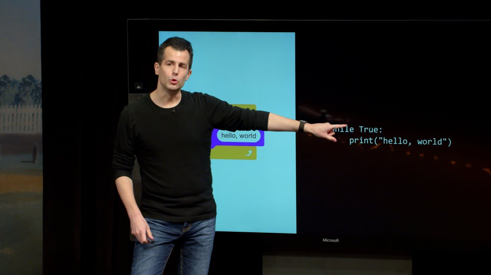

# Lecture: Python <small>David Malan</small>

[Open in CS50 video player](https://video.cs50.io/ZEQh45W_UDo?screen=A4eeGBU4qTE)

## Python Basics

*   Today we'll learn a new programming language called Python. A newer language than C, it has additional features as well as simplicity, leading to its popularity.
*   Source code in Python looks a lot simpler than C. In fact, to print "hello, world", all we need to write is:

        print("hello, world")

    *   Notice that, unlike in C, we don't need to specify a newline in the `print` function or use a semicolon to end our line.
    *   To write and run this program, we'll use the CS50 IDE, save a new file as `hello.py` with just the line above, and run the command `python hello.py`.
*   We can get strings from a user:

        answer = get_string("What's your name? ")
        print("hello, " + answer)

    *   We also need to import the Python version of the CS50 library, `cs50`, for just the function `get_string`, so our code will look like this:

            from cs50 import get_string

            answer = get_string("What's your name? ")
            print("hello, " + answer)

    *   We create a variable called `answer` without specifying the type, and we can combine, or concatenate, two strings with the `+` operator before we pass it into `print`.
*   We can use the syntax for **format strings**, `f"..."`, to plug in variables. For example, we could have written `print(f"hello, {answer}")` to plug in the value of `answer` into our string by surrounding it with curly braces.
*   We can create variables with just `counter = 0`. By assigning the value of `0`, we're implicitly setting the type to an integer, so we don't need to specify the type. To increment a variable, we can use `counter = counter + 1` or `counter += 1`.
*   Conditions look like:

        if x < y:
            print("x is less than y")
        elif x > y:
            print("x is greater than y")
        else:
            print("x is equal to y")

    *   Unlike in C, where curly braces are used to indicate blocks of code, the exact indentation of each line is what determines the level of nesting in Python.
    *   And instead of `else if`, we just say `elif`.
*   Boolean expressions are slightly different, too:

        while True:
            print("hello, world")

    *   Both `True` and `False` are capitalized in Python.
*   We can write a loop with a variable:

        i = 0
        while i < 3:
            print("hello, world")
            i += 1

*   We can also use a `for` loop, where we can do something for each value in a list:

        for i in [0, 1, 2]:
            print("cough")

    *   Lists in Python, `[0, 1, 2]`, are like arrays in C.
    *   This `for` loop will set the variable `i` to the first element, `0`, run, then to the second element, `1`, run, and so on.
    *   And we can use a special function, `range`, to get some number of values, as in `for i in range(3):`. `range(3)` will give us a list up to but not including 3, with the values `0`, `1`, and `2`, that we can then use. `range()` takes other options as well, so we can have lists that start at different values and have different increments between values. By looking at the [documentation](https://docs.python.org/3/library/stdtypes.html?highlight=range#range), for example, we can use `range(0, 101, 2)` to get a range from `0` to `100` (since the second value is exclusive), incrementing by `2` at a time.
    *   To print out `i`, too, we can just write `print(i)`.
    *   Since there are often multiple ways to write the same code in Python, the most commonly used and accepted ways are called **Pythonic**.
*   In Python, there are many built-in data types:
    *   `bool`, `True` or `False`
    *   `float`, real numbers
    *   `int`, integers
    *   `str`, strings
*   While C is a **strongly typed** language, where we need to specify types, Python is **loosely typed**, where the type is implied by the values.
*   Other types in Python include:
    *   `range`, sequence of numbers
    *   `list`, sequence of mutable values, or values we can change
        *   And lists, even though they're like arrays in C, can grow and shrink automatically in Python
    *   `tuple`, collection of ordered values like x- and y-coordinates, or longitude and latitude
    *   `dict`, dictionaries, collection of key/value pairs, like a hash table
    *   `set`, collection of unique values, or values without duplicates
*   The CS50 library for Python includes:
    *   `get_float`
    *   `get_int`
    *   `get_string`
*   And we can import functions one at a time, or all together:

        from cs50 import get_float
        from cs50 import get_int
        from cs50 import get_string

        import cs50

        from cs50 import get_float, get_int, get_string

## Examples

*   Since Python includes many features as well as libraries of code written by others, we can solve problems at a higher level of abstraction, instead of implementing all the details ourselves.
*   We can blur an image with:

        from PIL import Image, ImageFilter

        before = Image.open("bridge.bmp")
        after = before.filter(ImageFilter.BoxBlur(1))
        after.save("out.bmp")

    *   In Python, we include other libraries with `import`, and here we'll `import` the `Image` and `ImageFilter` names from the `PIL` library. (Other people have written this library, among others, and made it available for all of us to download and use.)
    *   `Image` is a structure that not only has data, but functions that we can access with the `.` syntax, such as with `Image.open`.
    *   We open an image called `bridge.bmp`, call a blur filter function, and save it to a file called `out.bmp`.
    *   And we can run this with `python blur.py` after saving to a file called `blur.py`.
*   We can implement a dictionary with:

        words = set()

        def load(dictionary):
          file = open(dictionary, "r")
          for line in file:
              words.add(line.rstrip())
          file.close()
          return True

        def check(word):
            if word.lower() in words:
                return True
            else:
                return False

        def size():
            return len(words)

        def unload():
            return True

    *   First, we create a new set called `words`.
    *   Notice that we haven't needed a `main` function. Our Python program will run from top to bottom. Here, we want to define a function, so we use `def load()`. `load` will take a parameter, `dictionary`, and its return value is implied. We open the file with `open`, and iterate over the lines in the file with just `for line in file:`. Then, we remove the newline at the end of `line`, and add it to our set `words`. Notice that `line` is a string, but has a `.rstrip` function we can call.
    *   Then, for `check`, we can just ask `if word.lower() in words`. For `size`, we can use `len` to count the number of elements in our set, and finally, for `unload`, we don't have to do anything, since Python manages memory for us.
*   It turns out, even though implementing a program in Python is simpler for us, the running time of our program in Python is slower than our program in C since the language has to do more work for us with general-purpose solutions, like for memory management.
*   In addition, Python is also the name of a program called an **interpreter**, which reads in our source code and translates it to code that our CPU can understand, line by line.
*   For example, if our pseudocode from week 0 was in Spanish, and we didn't understand Spanish, we would have to slowly translate it, line by line, into English before we could search for a name in a phone book:

        1   Recoge guía telefónica
        2   Abre a la mitad de guía telefónica
        3   Ve la página
        4   Si la persona está en la página
        5       Llama a la persona
        6   Si no, si la persona está antes de mitad de guía telefónica
        7       Abre a la mitad de la mitad izquierda de la guía telefónica
        8       Regresa a la línea 3
        9   Si no, si la persona está después de mitad de guía telefónica
        10      Abre a la mitad de la mitad derecha de la guía telefónica
        11      Regresa a la línea 3
        12  De lo contrario
        13      Abandona

*   So, depending on our goals, we'll also have to consider the tradeoff of human time of writing a program that's more efficient, versus the running time of the program.

### Input, conditions

*   We can get input from the user with the `input` function:

        answer = input("What's your name? ")
        print(f"hello, {answer}")

*   We can ask the user for two integers and add them:

        from cs50 import get_int

        # Prompt user for x
        x = get_int("x: ")

        # Prompt user for y
        y = get_int("y: ")

        # Perform addition
        print(x + y)

    *   Comments start with `#` instead of `//`.
*   If we call input ourselves, we get back strings for our values:

        # Prompt user for x
        x = input("x: ")

        # Prompt user for y
        y = input("y: ")

        # Perform addition
        print(x + y)

*   So we need to **cast**, or convert, each value from `input` into an `int` before we store it:

        # Prompt user for x
        x = int(input("x: "))

        # Prompt user for y
        y = int(input("y: "))

        # Perform addition
        print(x + y)

    *   But if the user didn't type in a number, we'll need to do even more error-checking or our program will crash. So we'll generally want to use a commonly used library to solve problems like this.
*   We'll divide values:

        # Prompt user for x
        x = int(input("x: "))

        # Prompt user for y
        y = int(input("y: "))

        # Perform division
        print(x / y)

    *   Notice that we get floating-point, decimal values back, even if we divided two integers.
*   And we can demonstrate conditions:

        from cs50 import get_int

        x = get_int("x: ")
        y = get_int("y: ")

        if x < y:
            print("x is less than y")
        elif x > y:
            print("x is greater than y")
        else:
            print("x is equal to y")

*   We can import entire libraries, and use functions inside them as if they were a struct:

        import cs50

        x = cs50.get_int("x: ")
        y = cs50.get_int("y: ")

    *   If our program needed to import two different libraries, each with a `get_int` function, for example, we would need to use this method to **namespace** functions, keeping their names in different spaces to prevent them fromm colliding.
*   To compare strings, we can say:

        from cs50 import get_string

        s = get_string("Do you agree? ")

        if s == "Y" or s == "y":
            print("Agreed.")
        elif s == "N" or s == "n":
            print("Not agreed.")

    *   Python doesn't have chars, so we check `Y` and other letters as strings. We can also compare strings directly with `==`. Finally, in our Boolean expressions we use `or` and `and` instead of symbols.
    *   We can also say `if s.lower() in ["y", "yes"]:` to check if our string is in a list, after converting it to lowercase first.

### meow

*   We can improve versions of `meow`, too:

        print("meow")
        print("meow")
        print("meow")

    *   We don't need to declare a `main` function, so we just write the same line of code three times.
*   We can define a function that we can reuse:

        for i in range(3):
            meow()

        def meow():
            print("meow")

    *   But this causes an error when we try to run it: `NameError: name 'meow' is not defined`. It turns out that we need to define our function before we use it, so we can either move our definition of `meow` to the top, or define a main function first:

            def main():
                for i in range(3):
                    meow()

            def meow():
                print("meow")

            main()

    *   Now, by the time we actually call our `main` function, the `meow` function will already have been defined.
*   Our functions can take inputs, too:

        def main():
            meow(3)

        def meow(n):
            for i in range(n):
                print("meow")

        main()

    *   Our `meow` function takes in a parameter, `n`, and passes it to `range`.

### get_positive_int

*   We can define a function to get a positive integer:

        from cs50 import get_int

        def main():
            i = get_positive_int()
            print(i)

        def get_positive_int():
            while True:
                n = get_int("Positive Integer: ")
                if n > 0:
                    break
            return n

        main()

    *   Since there is no do-while loop in Python as there is in C, we have a `while` loop that will go on infinitely, and use `break` to end the loop as soon as `n > 0`. Finally, our function will `return n`, at our original indentation level, outside of the `while` loop.
    *   Notice that variables in Python are **scoped to functions** by default, meaning that `n` can be initialized within a loop, but still be accessible later in the function.

### Mario

*   We can print out a row of question marks on the screen:

        for i in range(4):
            print("?", end="")
        print()

    *   When we print each block, we don't want the automatic new line, so we can pass a **named argument**, also known as keyword argument, to the `print` function, which specifies the value for a specific parameter. So far, we've only seen **positional arguments**, where parameters are set based on their position in the function call.
    *   Here, we say `end=""` to specify that nothing should be printed at the end of our string. `end` is also an **optional argument**, one we don't need to pass in, with a default value of `\n`, which is why `print` usually adds a new line for us.
    *   Finally, after we print our row with the loop, we can call `print` with no other arguments to get a new line.
*   We can also "multiply" a string and print that directly with: `print("?" * 4)`.
*   We can implement nested loops:

        for i in range(3):
            for j in range(3):
                print("#", end="")
            print()

### Overflow, imprecision

*   In Python, trying to cause an integer overflow actually won't work:

        i = 1
        while True:
            print(i)
            i *= 2

    *   We see larger and larger numbers being printed, since Python automatically uses more and more memory to store numbers for us, unlike C where integers are fixed to a certain number of bytes.
*   Floating-point imprecision, too, still exists, but can be prevented by libraries that can represent decimal numbers with as many bits as are needed.

### Lists, strings

*   We can make a list:

        scores = [72, 73, 33]

        print("Average: " + str(sum(scores) / len(scores)))

    *   We can use `sum`, a function built into Python, to add up the values in our list, and divide it by the number of scores, using the `len` function to get the length of the list. Then, we cast the float to a string before we can concatenate and print it.
    *   We can even add the entire expression into a formatted string for the same effect:

            print(f"Average: {sum(scores) / len(scores)}")

*   We can add items to a list with:

        from cs50 import get_int

        scores = []
        for i in range(3):
            scores.append(get_int("Score: "))
        ...

*   We can iterate over each character in a string:

        from cs50 import get_string

        s = get_string("Before:  ")
        print("After: ", end="")
        for c in s:
            print(c.upper(), end="")
        print()

    *   Python will iterate over each character in the string for us with just `for c in s`.
*   To make a string uppercase, we can also just call `s.upper()`, without having to iterate over each character ourselves.

### Command-line arguments, exit codes

*   We can take command-line arguments with:

        from sys import argv

        if len(argv) == 2:
            print(f"hello, {argv[1]}")
        else:
            print("hello, world")

    *   We import `argv` from `sys`, or system module, built into Python.
    *   Since `argv` is a list, we can get the second item with `argv[1]`, so adding an argument with the command `python argv.py David` will result in `hello, David` printed.
    *   Like in C, `argv[0]` would be the name of our program, like `argv.py`.
*   We can also let Python iterate over the list for us:

        from sys import argv

        for arg in argv:
            print(arg)

*   We can return exit codes when our program exits, too:

        import sys

        if len(sys.argv) != 2:
            print("missing command-line argument")
            sys.exit(1)
        print(f"hello, {sys.argv[1]}")
        sys.exit(0)

    *   We import the entire `sys` module now, since we're using multiple components of it. Now we can use `sys.argv` and `sys.exit()` to exit our program with a specific code.

### Algorithms

*   We can implement linear search by just checking each element in a list:

        import sys

        numbers = [4, 6, 8, 2, 7, 5, 0]

        if 0 in numbers:
            print("Found")
            sys.exit(0)

        print("Not found")
        sys.exit(1)

    *   With `if 0 in numbers:`, we're asking Python to check the list for us.
*   A list of strings, too, can be searched with:

        names = ["Bill", "Charlie", "Fred", "George", "Ginny", "Percy", "Ron"]

        if "Ron" in names:
            print("Found")
        else:
            print("Not found")

*   If we have a dictionary, a set of key-value pairs, we can also check for a particular key, and look at the value stored for it:

        from cs50 import get_string

        people = {
            "Brian": "+1-617-495-1000",
            "David": "+1-949-468-2750"
        }

        name = get_string("Name: ")
        if name in people:
            print(f"Number: {people[name]}")

    *   We first declare a dictionary, `people`, where the keys are strings of each name we want to store, and the value we want to associate with each key is a string of a corresponding phone number.
    *   Then, we use `if name in people:` to search the keys of our dictionary for a `name`. If the key exists, then we can get the value with the bracket notation, `people[name]`, much like indexing into an array with C, except here we use a string instead of an integer.
    *   Dictionaries, as well as sets, are typically implemented in Python with a data structure like a hash table, so we can have close to constant time lookup. Again, we have the tradeoff of having less control over exactly what happens under the hood, like being able to choose a hash function, with the benefit of having to do less work ourselves.
*   Swapping two variables can also be done simply by assigning both values at the same time:

        x = 1
        y = 2

        print(f"x is {x}, y is {y}")
        x, y = y, x
        print(f"x is {x}, y is {y}")

    *   In Python, we don't have access to pointers, which protects us from making mistakes with memory.

## Files

*   Let's open a CSV file:

        import csv

        from cs50 import get_string

        file = open("phonebook.csv", "a")

        name = get_string("Name: ")
        number = get_string("Number: ")

        writer = csv.writer(file)
        writer.writerow([name, number])

        file.close()

    *   It turns out that Python also has a `csv` library that helps us work with CSV files, so after we open the file for appending, we can call `csv.writer` to create a `writer` from the file, which gives additional functionality, like `writer.writerow` to write a list as a row.
*   We can use the `with` keyword, which will close the file for us after we're finished:

        ...
        with open("phonebook.csv", "a") as file:
            writer = csv.writer(file)
            writer.writerow((name, number))

*   We can open another CSV file, tallying the number of times a value appears:

        import csv

        houses = {
            "Gryffindor": 0,
            "Hufflepuff": 0,
            "Ravenclaw": 0,
            "Slytherin": 0
        }

        with open("Sorting Hat (Responses) - Form Responses 1.csv", "r") as file:
            reader = csv.reader(file)
            next(reader)
            for row in reader:
                house = row[1]
                houses[house] += 1

        for house in houses:
            print(f"{house}: {houses[house]}")

    *   We use the `reader` function from the `csv` library, skip the header row with `next(reader)`, and then iterate over each of the rest of the rows.
    *   The second item in each row, `row[1]`, is the string of a house, so we can use that to access the value stored in `houses` for that key, and add one to it.
    *   Finally, we'll print out the count for each house.

## More libraries

*   On our own Mac or PC, we can open a terminal after installing Python, and use another library to convert text to speech:

        import pyttsx3

        engine = pyttsx3.init()
        engine.say("hello, world")
        engine.runAndWait()

    *   By reading the documentation, we can figure out how to initialize the library, and say a string.
    *   We can even pass in a format string with `engine.say(f"hello, {name}")` to say some input.
*   We can use another library, `face_recognition`, to find faces in images:

        # Find faces in picture
        # https://github.com/ageitgey/face_recognition/blob/master/examples/find_faces_in_picture.py

        from PIL import Image
        import face_recognition

        # Load the jpg file into a numpy array
        image = face_recognition.load_image_file("office.jpg")

        # Find all the faces in the image using the default HOG-based model.
        # This method is fairly accurate, but not as accurate as the CNN model and not GPU accelerated.
        # See also: find_faces_in_picture_cnn.py
        face_locations = face_recognition.face_locations(image)

        for face_location in face_locations:

            # Print the location of each face in this image
            top, right, bottom, left = face_location

            # You can access the actual face itself like this:
            face_image = image[top:bottom, left:right]
            pil_image = Image.fromarray(face_image)
            pil_image.show()

*   With [recognize.py](https://cdn.cs50.net/2020/fall/lectures/6/src6/6/faces/recognize.py), we can write a program that finds a match for a particular face.
*   We can create a QR code, or two-dimensional barcode, with another library:

        import os
        import qrcode

        img = qrcode.make("https://youtu.be/oHg5SJYRHA0")
        img.save("qr.png", "PNG")
        os.system("open qr.png")

*   We can recognize audio input from a microphone:

        import speech_recognition

        # Obtain audio from the microphone
        recognizer = speech_recognition.Recognizer()
        with speech_recognition.Microphone() as source:
            print("Say something:")
            audio = recognizer.listen(source)

        # Recognize speech using Google Speech Recognition
        print("You said:")
        print(recognizer.recognize_google(audio))

    *   We're following the documentation of the library to listen to our microphone and convert it to text.
*   We can even add additional logic for basic responses:

        ...
        words = recognizer.recognize_google(audio)

        # Respond to speech
        if "hello" in words:
            print("Hello to you too!")
        elif "how are you" in words:
            print("I am well, thanks!")
        elif "goodbye" in words:
            print("Goodbye to you too!")
        else:
            print("Huh?")

*   Finally, we use another, more sophisticated program to generate deepfakes, or realistic-appearing but computer-generated videos of various personalities.
*   By taking advantage of all these libraries that are freely available online, we can easily add advanced functionality to our own applications.
