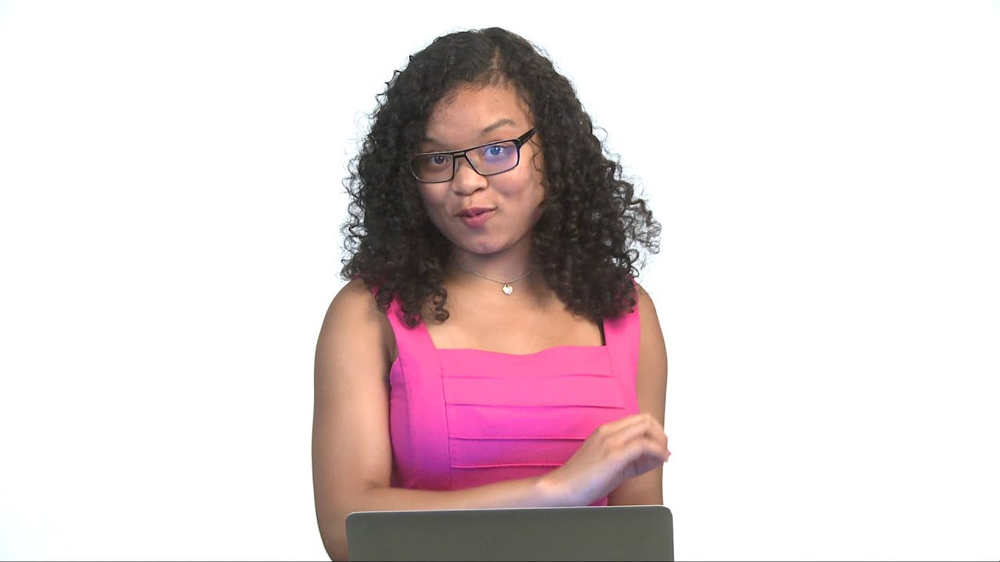

# Scratch

> Samenwerken bij deze opdracht is niet toegestaan anders dan het om hulp vragen bij medestudenten en anderen, als de hulp er maar niet op neerkomt dat iemand anders het werk voor je doet, zoals ook na te lezen in de regels over samenwerken in de studiewijzer.

## Itching to Program?

It's time to choose your own adventure! Your assignment, quite simply, is to implement in Scratch any project of your choice, be it an interactive story, game, animation, or anything else, subject only to the following requirements:

* Your project must have at least two sprites, at least one of which must resemble something other than a cat.
* Your project must have at least three scripts total (i.e., not necessarily three per sprite).
* Your project must use at least one condition, one loop, and one variable.
* Your project must use at least one sound.
* Your project should be more complex than most of those demonstrated in lecture (many of which, though instructive, were quite short) but it can be less complex than *Ivy's Hardest Game*. As such, your project should probably use a few dozen puzzle pieces overall.

Head to [the Scratch website](https://scratch.mit.edu/) and sign up for an account on MIT's website by clicking **Join Scratch** atop the page. Any username (that's available) is fine, but take care to remember it and your choice of password.  After registering and confirming your email address, click the orange "**Start Creating**" button to begin.

## Help and ideas

If you'd like to try out some Scratch projects from past students, here are a few:

- [It's Raining Men](https://scratch.mit.edu/projects/37412/), from lecture
- [Ivy's Hardest Game](https://scratch.mit.edu/projects/326129587/), a game, Harvard edition
- [Soccer](https://scratch.mit.edu/projects/37413/), a game
- [Cookie Love Story](https://scratch.mit.edu/projects/26329196/), an animation
- [Gingerbread tales](https://scratch.mit.edu/projects/26329196/), an interactive story
- [Intersection](https://scratch.mit.edu/projects/75390754/), a game
- [Oscartime](https://scratch.mit.edu/projects/277537196/), a game

And, to get better acquainted to Scratch's blocks, watch Zamyla's walkthrough:

[Open Walkthrough on Youtube](https://www.youtube.com/watch?v=697pD31GCZg)

Stuck for ideas? Here are some of your [predecessors' projects](https://scratch.mit.edu/studios/4248580/). But try to think of an idea on your own, and then set out to implement it. However, don't try to implement the entirety of your project all at once: pluck off one piece at a time. In other words, take baby steps: write a bit of code (i.e., drag and drop a few puzzle pieces), test, write a bit more, test, and so forth. And select **File > Save Now** every few minutes so that you don't lose any work!

If, along the way, you find it too difficult to implement some feature, try not to fret; alter your design or work around the problem. If you set out to implement an idea that you find fun, odds are you won't find it too hard to satisfy the above requirements. 

Alright, off you go. Make us proud! 

## How to Submit

Once finished with your project:

- Select **File > Save to your computer** at the top of the scratch website. This should download a file whose name ends in `.sb3`.

- Click the orange **Share** button at the top of Scratch's editor, which will redirect you to the "Project page". On that page, ensure your project has a title, some instructions, and some notes and/or credits. Finally, take note of the URL in your browser's address bar. That's your project's URL on MIT's website.

- Below, you should find a form where you can attach your `.sb3` file and paste your project's URL. If there is no form, you might have forgotten to logon to this website and register your name!

If you have any questions or issues with the above steps, reach out to the TAs!
