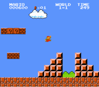

# Mario, part deux

Implementeer een programma dat een dubbele half-piramide afdrukt met een gespecificeerde hoogte, zoals hieronder weergegeven.

    $ ./mario
    Hoogte: 4
       #  #
      ##  ##
     ###  ###
    ####  ####

## Achtergrond

Aan het begin van de wereld 1-1 in Nintendo's Super Mario Brothers moet Mario over twee "half-piramides" van blokken springen terwijl hij naar een vlaggenmast gaat. Hieronder vind je een screenshot.

## Specificatie

* Schrijf, in een bestand genaamd `mario.c`, een programma dat deze half-piramides op het scherm tovert met behulp van hekjes (`#`).

* Maak het interessanter door eerst de gebruiker om de hoogte van de half-piramides te vragen, een niet-negatief geheel getal dat niet groter is dan `8`. (De hoogte van de half-piramides op de bovenstaande afbeelding is toevallig `4`, en daarom is de breedte van elke half-piramide `4`, met een tussenruimte van `2` ertussen.)

* Als de gebruiker er niet in slaagt een niet-negatief geheel getal niet groter dan `8` op te geven, moet je opnieuw om de hoogte vragen.

* Genereer vervolgens (met behulp van `printf` en een of meer loops) de gewenste half-piramides.

* Zorg ervoor dat de linker onderhoek van de linker half-piramide wordt uitgelijnd met de linker rand van je terminalvenster (strak ertegenaan).

## Tips

Probeer een relatie vast te stellen tussen (a) de hoogte die de gebruiker wil dat de piramide heeft, (b) welke rij momenteel wordt afgedrukt, en (c) hoeveel spaties en hoeveel hashes er in die rij zitten. Zodra je de formule hebt vastgesteld, kun je deze naar C vertalen!

## Ontwerp

Denk na over welke functies je zou kunnen schrijven naast de `main`.

## Voorbeelden

Je programma moet zich gedragen zoals in de onderstaande voorbeelden.

    $ ./mario
    Hoogte: 4
       #  #
      ##  ##
     ###  ###
    ####  ####

    $ ./mario
    Hoogte: 0

    $ ./mario
    Hoogte: -5
    Hoogte: 4
       #  #
      ##  ##
     ###  ###
    ####  ####

    $ ./mario
    Hoogte: -5
    Hoogte: vijf
    Hoogte: 40
    Hoogte: 24
    Hoogte: 4
       #  #
      ##  ##
     ###  ###
    ####  ####
