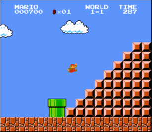

# Mario

Aan het einde van de wereld 1-1 in Nintendo's Super Mario Brothers moet Mario
een rechts uitgelijnde piramide van blokken beklimmen, zoals hieronder.

Laten we die piramide in C nabootsen, maar dan in tekst, gebruikmakend van hashes (`#`) om de stenen weer te geven, zoals hieronder. Elke hash is iets langer dan hij breed is, dus de piramide zelf wordt (visueel) ook langer dan hij breed is.

           #
          ##
         ###
        ####
       #####
      ######
     #######
    ########

Het programma dat we gaan schrijven zal `mario.c` heten. De gebruiker mag beslissen hoe hoog de piramide moet zijn, dus vragen we die eerst om een positief geheel getal tussen, laten we zeggen, 1 en 8, *inclusief*.

Het programma zou dus als volgt kunnen werken als de gebruiker `8` invoert:

    $ ./mario
    Hoogte: 8
           #
          ##
         ###
        ####
       #####
      ######
     #######
    ########

En zo zou het programma kunnen werken als de gebruiker `4` invoert:

    $ ./mario
    Hoogte: 4
       #
      ##
     ###
    ####

Zo zou het programma kunnen werken als de gebruiker `2` invoert:

    $ ./mario
    Hoogte: 2
     #
    ##

En zo zou het programma kunnen werken als de gebruiker `1` invoert:

    $ ./mario
    Hoogte: 1
    #

Als de gebruiker toch géén positief geheel getal tussen 1 en 8 invoert moet het programma de gebruiker opnieuw vragen totdat ze meewerken:

    $ ./mario
    Hoogte: -1
    Hoogte: 0
    Hoogte: 42
    Hoogte: 50
    Hoogte: 4
       #
      ##
     ###
    ####

Hoe te beginnen? Laten we dit probleem stap voor stap aanpakken.

[Open video op Youtube](https://www.youtube.com/watch?v=NAs4FIWkJ4s)

## Pseudocode

Maak een nieuw bestand genaamd `mario_pseudocode.txt`. Schrijf wat pseudocode die dit programma implementeert, ook al weet je (nog!) niet hoe je het in code moet schrijven. Er is geen enige juiste manier om pseudocode te schrijven, maar korte Engelse zinnen volstaan. Denk eraan hoe we pseudocode schreven voor het vinden van Mike Smith in het telefoonboek! Waarschijnlijk zal je pseudocode impliciet of expliciet gebruik maken van één of meer functies, condities, booleaanse expressies, loops en/of variabelen.

Spoiler

Er zijn meer manieren om dit te doen, dus hier is er slechts één!

1.  Vraag de gebruiker om een hoogte
2.  Als de hoogte kleiner is dan 1 of groter dan 8 (of helemaal geen geheel getal), ga terug naar stap één
3.  Itereer van 1 tot hoogte:
    1.  Print in iteratie _i_ _i_ hashes en daarna een newline

Het is oké om je eigen pseudocode te bewerken na het zien van deze oplossing, maar simpelweg kopiëren/plakken is zeker niet de bedoeling!

## Vragen om input

Wat je pseudocode ook is, laten we eerst alleen de C-code schrijven die de gebruiker vraagt (en opnieuw vraagt, indien nodig) om invoer. Maak daarvoor een nieuw bestand genaamd `mario.c`.

Bewerk dan `mario.c` zo dat het de gebruiker vraagt naar de hoogte van de piramide, hun invoer opslaat in een variabele, en de gebruiker herhaaldelijk opnieuw vraagt indien de invoer geen positief geheel getal tussen 1 en 8, inclusief, is. Print dan simpelweg de waarde van die variabele (dus nog geen piramide), en bevestig daarmee voor jezelf dat dit deel van het programma goed lijkt te werken.

    $ ./mario
    Hoogte: -1
    Hoogte: 0
    Hoogte: 42
    Hoogte: 50
    Hoogte: 4
    Opgeslagen: 4

### Tips voor dit onderdeel

- Bedenk dat je een `int` kunt printen met `printf` gebruikmakend van `%i`.
- Bedenk dat je een geheel getal kunt krijgen van de gebruiker met `get_int`.
- Bedenk dat `get_int` is gedeclareerd in `cs50.h`.
- Bedenk dat we de gebruiker al een keer vroegen om een *positief* geheel getal in het programma `positive.c` tijdens het college.

## Precies het tegenovergestelde

Nu je programma (hopelijk!) invoer accepteert zoals voorgeschreven, is het tijd voor de volgende stap.

Het blijkt dat het iets makkelijker is om een links uitgelijnde piramide te bouwen dan een rechts uitgelijnde. Als voorbeeld:

    #
    ##
    ###
    ####
    #####
    ######
    #######
    ########

Laten we daarom eerst deze links uitgelijnde piramide bouwen en dan, zodra dat werkt, deze naar rechts uitlijnen.

Bewerk `mario.c` zo dat het niet langer de invoer van de gebruiker (het getal) print, maar in plaats daarvan een links uitgelijnde piramide van die hoogte.

### Tips voor dit onderdeel

- Bedenk dat een "hash" gewoon een teken is zoals elk ander, dus je kunt het printen met `printf`.

- Net zoals Scratch een Herhaal-blok heeft, heeft C een `for`-loop, waarmee je een aantal keren kunt itereren. Misschien kun je bij elke iteratie, dus in stap `i`, precies `i` hekjes printen?

- Je kunt loops "nesten", namelijk itereren met één variabele (bijv., `i`) in de "buitenste" loop en met een andere (bijv., `j`) in de "binnenste" loop. Hier is bijvoorbeeld hoe je een vierkant zou printen van hoogte en breedte `n`. Het is natuurlijk geen vierkant dat je wilt printen, maar op een bepaalde manier moet dit stukje code je wel kunnen helpen!

        for (int i = 0; i < n; i++)
        {
            for (int j = 0; j < n; j++)
            {
                printf("#");
            }
            printf("\n");
        }

## Rechts uitlijnen met puntjes

Laten we die piramide nu naar rechts uitlijnen. We gaan de hekjes naar rechts "duwen" door ze te prefixen met puntjes (`.`), zoals hieronder.

    .......#
    ......##
    .....###
    ....####
    ...#####
    ..######
    .#######
    ########

Bewerk `mario.c` zo dat het precies dat doet!

### Tip voor dit onderdeel

Merk op hoe het *aantal* puntjes op elke regel het "tegenovergestelde" is van het aantal hekjes op die regel. Voor een piramide van hoogte 8, zoals hierboven, heeft de eerste regel maar 1 hash en dus 7 puntjes. De onderste regel, ondertussen, heeft 8 hashes en dus 0 puntjes. Via welke formule zou je op elke regel het juiste aantal puntjes kunnen printen?

### Testen

Werkt je code zoals voorgeschreven wanneer je invoert:

- `-1` (of andere negatieve getallen)?
- `0`?
- `1` tot en met `8`?
- `9` of andere positieve getallen?
- letters of woorden?
- geen invoer, wanneer je alleen op Enter drukt?

## Verwijderen van de puntjes

Nog één ding! Bewerk `mario.c` zo dat het spaties in plaats van die puntjes print. Hiermee zou het programma precies zo moeten werken als in de voorbeelden bovenaan deze opgave.

### Tip voor dit laatste onderdeel

Een spatie krijg je gewoon met een druk op je spatiebalk, net zoals je een punt krijgt door de toets met een punt erop in te drukken. Denk er alleen aan dat `printf` vereist dat je aanhalingstekens gebruikt als je zo'n teken wil printen.
