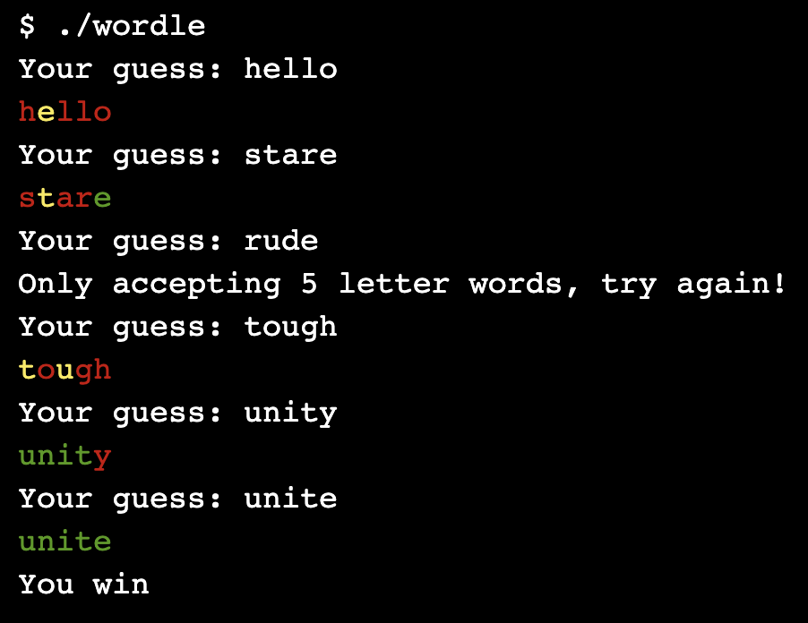
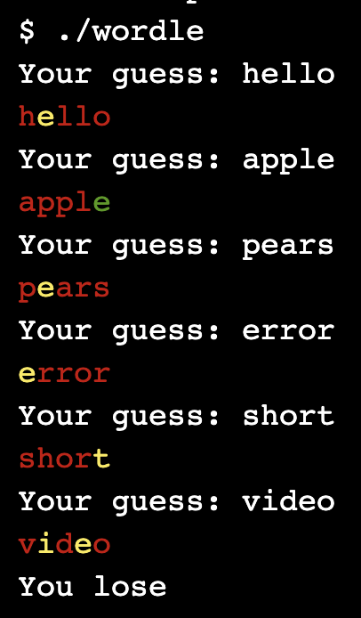

# Wordle

Schrijf een programma `wordle.c` dat een gebruiker het spel [Wordle](https://www.nytimes.com/games/wordle/index.html) laat spelen. Het spel moet als volgt werken:

Om kleuren uit te printen in de terminal zie [ANSI Escape Codes](https://gist.github.com/fnky/458719343aabd01cfb17a3a4f7296797). Gebruik de kleuren Red, Green en Yellow met respectievelijke codes 31, 32 en 33.

Hieronder staat een C array met 100 woorden voor het programma om uit te kiezen. Dit is voldoende voor deze opdracht, maar je mag het aantal woorden uitbreiden.

    string wordle_words[] = {
        "apple", "grape", "mango", "peach", "berry", "chess", "brick", "flame", "glove", "happy",
        "jolly", "kiosk", "lemon", "mirth", "noble", "ocean", "piano", "queen", "ranch", "sunny",
        "table", "umbra", "vivid", "witty", "xerox", "yacht", "zebra", "adore", "blink", "crisp",
        "drown", "earth", "frost", "gloom", "haste", "ideal", "jumpy", "kneel", "lunar", "mirth",
        "nerdy", "optic", "peace", "quirk", "roast", "stout", "trust", "ultra", "vocal", "waver",
        "xenon", "yearn", "zesty", "angry", "brisk", "charm", "dizzy", "eager", "fable", "grain",
        "haste", "ivory", "jumbo", "koala", "latch", "mourn", "nudge", "orbit", "plush", "quilt",
        "risky", "shiny", "trick", "unzip", "hello", "whale", "xylor", "yodel", "zebra", "amber",
        "beast", "chili", "dough", "ember", "flock", "glint", "hover", "inbox", "jazzy", "knack",
        "lobby", "marsh", "novel", "outdo", "prank", "quirk", "raven", "swoop", "tweak", "unite"
    };
    
> Om willekeurig (random) te kiezen wil je waarschijnlijk gebruik maken van `rand()` en `srand()`. Zie [deze uitleg](https://www.shiksha.com/online-courses/articles/rand-and-srand-functions-in-c-programming/).