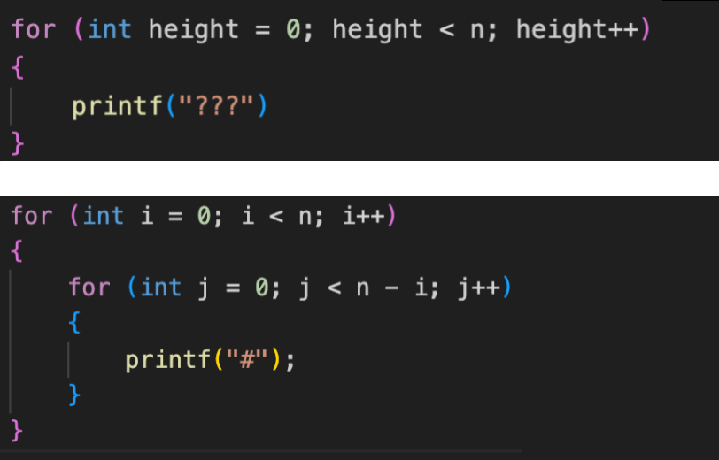

# Review-verslag en verbeteren

Na de code review ga je in een document (.pdf) in jouw eigen woorden en met voorbeelden beschrijven wat er in de code review ter sprake kwam. Wat je gaat aanpassen, wat niet, en waarom dit de code beter maakt.

## Wat kwam er ter sprake?

Beschrijf analytisch en puntsgewijs in `verslag.pdf` de dingen die jullie zijn tegen gekomen tijdens de review: de eigenschappen die vershillen per uitwerking. Enkele voorbeelden:

* Roos gebruikt in iedere loop de variabele namen i & j, Milan gebruikt soms namen als hoogte & stap.

    {: width="400"}

* Hidde heeft drie keer ongeveer dezelfde regel code onder elkaar. Amy gebruikt op dezelfde plek een loop, maar heeft daardoor wel meer regels code.

    {: width="400"}

* Brenda gebruikt geen haakjes bij kleine if-statements. Tom & Eva hebben juist overal haakjes staan.

    {: width="400"}

## Verbeter je code

Verbeter jouw uitwerking naar eigen smaak. Gebruik de code review als input en ook de feedback van de vorige code review. Probeer vooral je eigen stijl te vinden en neem niet droog de oplossing van een ander over.

Hou ondertussen goed bij wat je aanpast en schrijf alvast kort voor jezelf op waarom je iets doet, of kiest om iets niet te doen. Een goed cijfer is dan ook niet afhankelijk van de keuze van een specifieke stijl, maar wel hoe goed jouw stijl bij de oplossing past en de afwegingen die je maakt.

## Beschrijf je verbeteringen

Schrijf nu het tweede deel van `verslag.pdf`. Schrijf ook hier analytisch. Dat betekent dat je geen verhaal gaat vertellen in de verleden tijd, maar een beschouwing van de verbeteringen die je hebt toegepast.

Beschrijf puntsgewijs de wijzigingen die jij hebt gedaan in jouw code en beredeneer waarom elke wijziging ook een verbetering is. Beschrijf natuurlijk ook de wijzigingen die je definitief *niet* gaat doen: er kan een goede reden zijn om iets te houden zoals het is. Zorg dat je met voldoende diepgang beschrijft waarom jouw code is zoals die is.

Het is gewenst om kleine(!!!!) screenshots van code in te voegen om duidelijk te illustreren waar je het over hebt in het verslag. Klein betekent: geen volledig scherm, alleen een netjes uitgeknipt relevant stukje van de code. Bijvoorbeeld zoals de code voorbeelden bovenin deze tekst.

Bijvoorbeeld:

* Alle controle structuren zoals if, while en for hebben nu haakjes, ook al staat er maar één regel code in. Zo is dit overal consistent en kan ik makkelijk een regel code toevoegen, zonder na te hoeven denken over haakjes. Tijdens het verbeteren van de code wou ik even snel een print statement toevoegen om te debuggen, maar als je dan de haakjes vergeet ben je alleen maar langer bezig. Dat weegt voor mij op tegen de minder regels code.

* De ingewikkelde condities in de if-statements heb ik uitgesplitst en opgeslagen in variabelen. Iedere variabele heeft een begrijpbare naam waardoor het geheel nu ook makkelijker te begrijpen is. Het wordt zo wel veel code zoals bijvoorbeeld hieronder. Voor consistentie heb ik het hier nu ook gedaan, maar ik twijfel of het helpt bij het begrijpen van de code.

    {: width="400"}

* De duplicate code heb ik laten staan. Hoewel het daardoor misschien moeilijker is om de code aan te passen en het makkelijker is om fouten te maken. Maar de code is nu toch echt heel makkelijk te begrijpen en een stuk korter dan de code van mijn review partner.

    {: width="400"}

## Inleveren

Lever hieronder de verbeterde uitwerking in, met daarbij een PDF (geen ander formaat) met je verslag. Zet je naam en studentnummer boven het verslag, en ook de naam van het programma dat gereviewed is.

## Beoordeling

De code en het verslag worden beoordeeld met hulp van het volgende schema:

6. uitzonderlijke kwaliteit op basis van een doordacht ontwerp met scherp onderbouwde keuzes
5. goede kwaliteit, beperkt ruimte voor verbetering en alle keuzes zijn goed onderbouwd
4. degelijke kwaliteit, ruimte voor verbetering, meerdere keuzes zijn goed onderbouwd
3. voldoende aandacht voor alle genoemde aspecten, veel ruimte voor verbetering, alle keuzes zijn beredeneerd
2. enige zichtbare aandacht voor een beperkt aantal aspecten, of er zijn keuzes zonder redenatie
1. onvoldoende zichtbare aandacht voor de genoemde aspecten, of er is geen redenatie bij de keuzes
{: start="6" reversed=""}

Voor deze laatste code review kan je maximaal 6 punten halen. Let wel op, dat is niet makkelijk en het is ook zeker niet de verwachting dat iedere student dat haalt. Voor 6 punten is naast de kwaliteit ook het ontwerp van belang, dat wil zeggen dat je een eigen insteek hebt gekozen voor de oplossing van de opdrachten. Daarvoor zal je verder moeten gaan dan wat de opdracht en het lesmateriaal aanreikt. 
