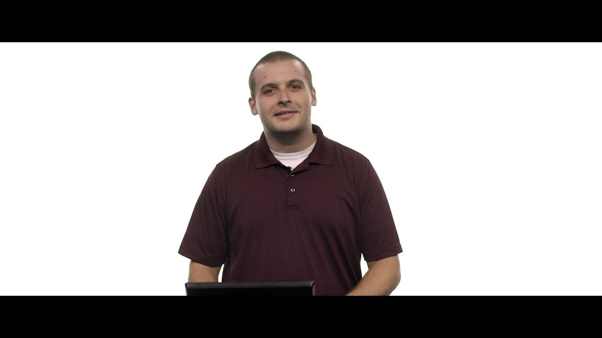

# Short: Working in the IDE

The CS50 IDE is an online environment in which you can write code, compile your programs and debug those using built-in tools. In fact, you are provided with access to a Ubuntu Linux command line, which will be running somewhere in the United States.

## GitHub

To get started, the first thing you do is create an account on [GitHub](https://github.com/join). This website is used by software developers around the world to collaborate. In later courses, you might use the website directly to put your own programs on! However, for this course, we use GitHub's login mechanism to allow you access to a few other websites created by Harvard's CS50 team.

## Logging in

Head to [ide.cs50.io](https://ide.cs50.io/) and log into CS50 IDE using the GitHub account that you created. Note that the IDE works best using Chrome as a web browser. If you do not have it yet, you can install it specifically to work with the IDE.

If all is well, you should then be informed that CS50 IDE (aka Cloud9, the software that underlies CS50 IDE) is "creating your workspace" and "creating your container," which might take a moment. You should eventually see your workspace. If not, do just email the course's heads to inquire!

### Working with the command line

In the movie below, Doug explains how to use the Linux "command line" that is included in the CS50 IDE. You will need to use many of the commands while developing in C, but also later when you're advancing as a programmer.

[Open video on Youtube](https://www.youtube.com/watch?v=BnJ013X02b8)

Note that currently, your **default** folder in the IDE is not called `~/workspace` but `~/` instead. This simply means that in Doug's version, all his files are in a subfolder called `workspace`, whereas in the current version of the IDE your files are in your main folder called `~` (home).
