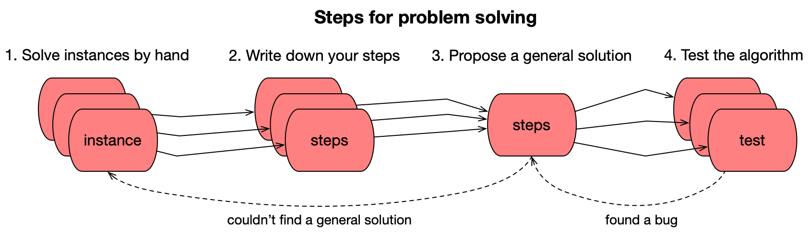
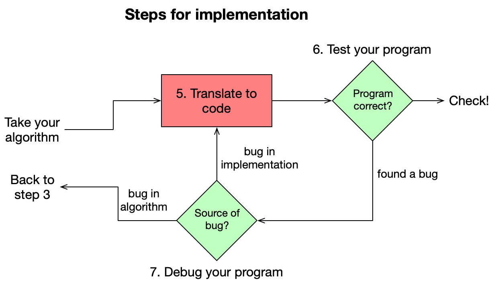

# The Steps

Below you'll find three phases that you are going to move through will solving some module's programming problems. For each problem, you will first perform an **analysis** together with your partner. Then, you will **implement** a solution in program code by yourself (with generous help from the course's staff, of course). Finally, for all of the problems together, you will do a **review** with your partner to learn how to improve code.

## Phase 1: Analyzing the problem

Problems in this course are fairly large. Most of these problems have a couple of parts that work together. The first thing to do is to roughly identify those parts, because you can apply the method below on each of those separately parts. For example, many programs have a section that is responsible for getting user input, separate from the main algorithm. Having done that, proceed to step 1.

**Step 1. Solve instances by hand (with partner)**

You have read the problem description and are ready to start analyzing. To do this, come up with a number of **instances** of the problem, each of which combines some **input** with the expected **output**.

Most likely, your problem description already contains one or two examples of running the program, with accompanying solutions. Take two other examples and try to solve these by hand, predicting the outcome for each and carefully thinking how you actually get to the solution.

Do you have a problem getting to the right solution or finding how to make some calculation? That means that either the problem is **underspecified** or you might lack a tiny bit of **knowledge** from the problem domain. Try to figure out which one it is and ask for help if needed!

> **Intermezzo. Watch the walkthrough**
> 
> Some of our problems come with a **walkthrough** movie in which some of the core assumptions and ideas are explained. If it appears that you lack some domain knowledge, it is likely that this is explained in the walkthrough.
> 
> Ideally, you watch the walkthrough just after you have tried solving some of the problem instances yourself. Note that the walkthroughs often also explain practical matters of getting input and formatting output. The Steps only concern the core algorithm, so be sure to get back to the walkthrough as soon as you are ready to code your solution.

**Step 2. Write down your steps (with partner)**

The real analysis happens when you try to retrace your steps for solving the problem. Try to find which exact steps you are taking and writing those down. You would do this in plain language, writing instructions that you might give to someone else to work out the problem.

You might find that it's hard to do for some examples, because you can too easily "see" the answer, which prevents you from deeply analyzing it. In that case it is advisable to find more complicated example problems. This is also something you could ask help with if needed!

**Step 3. Propose a general solution (with partner)**

If you have three or four examples worked out, you should be able to start composing a more general solution. Carefully compare the different examples, finding which steps are similar and which are different. Especially note if you did something multiple times (how often?) and how this relates to the example.

If you can't quite find a difference, chances are that your steps are still too **abstract** and you may try specifying smaller steps. Also, try to work some more examples when you get stuck. Then, try comparing the steps again.

Your algorithm should again be written in plain language, but this time clearly specify what kind of input the algorithm can work with. If the algorithm is based on a number, what kind of numbers would be acceptable? If it is based on a string, what kinds of strings would be reasonable to use the algorithm with?

**Step 4. Test the algorithm (with partner)**

Now you can have a look if you can verify that your algorithm is correct. Take a few new test cases and very carefully trace the steps. To ensure that steps aren't **ambiguous**, you might also want to have someone else test the steps for you. Having precise steps that are not open to interpretation will make it easier to translate the steps into code.

Testing thoroughly might also reveal some fundamental problems in your algorithm. You may have made an **assumption** about the input that makes the solution easier to find, but prevents your algorithm working with other input. Ideally, you are able to fix these bugs before you actually start coding your solution.

## Phase 2: Implementing the solution

**Step 5. Translate to code (separately)**

Once you are satisfied that your algorithm is general enough, and you have tested it thoroughly with your partner, you can start translating it into a working program. Some actual program code may already be provided by us, so make sure that you download that and use it as a starting point. Identify the place where you should be implementing your algorithm.

For this step, you can switch from working with domain knowledge to working with knowledge of the programming language. You have already specified the steps to take and now need to translate these into the **constructs** that are available in your programming language. If you can't quite figure out how to translate a step, be sure to ask for help!

**Step 6. Test the program (separately)**

The simplest way to test your program is to use exactly those problem instances that you used in steps 1 and 2. You already know the correct solutions to those instances and should be able to verify that your program now provides the same solution when run.

However, if you see a difference, you may have made a **mistake** somewhere while specifying the algorithm or while implementing the solution in code. At that point, your job it to figure out where the problem might be. Again, this is an excellent point to ask for help if needed.

As soon as you find that your program appears to be functioning correctly, use the provided test tools to double-check that the course staff agrees that your program works according to the specification. At this point, you may unexpectedly find that the tool doesn't think it works! In that case, take special notice of the **formatting** of your program's output. Is everything exactly as expected?

**Step 7. Debug the program (separately)**

Have you found an apparent problem with the program? Then find out what is going on, either tracing it back to a **bug** in your implementation, or a more fundamental problem in the steps of your algorithm.

One thing to check is if you have a **systematic** error in your program or that it doesn't work for only part of the test cases. This may help you find the source of the problem.

## Phase 3: Reviewing the code

**Step 8. Peer review your programs (with partner)**

When everything is in order, and your program is found to be correct, you are going to do a peer review with your partner. The idea is not to compare your solutions per se, but more to **improve** each solution as it is.

The **goal** of improvement is to make the programs easier to read and to understand. For each module, several aspects are listed to look out for. Read the explanations about these aspects before doing the actual review. Try to stick to these aspects, and especially take care not to try to influence your partner too much with your own ideas. The goal of this part of the course is to have you practice with techniques to make code better.

First, take the programs of your partner and browse through them. Your partner listens to what you say as you are trying to read their programs. Try not to give advice, but instead **think aloud** about what happens when you read the programs. Your partner makes notes of what they would like to change or any problems that appear during the review. When you're done, your partner asks you about things that were not quite clear.

Then, your partner takes your programs and browses through those. Again, your partner will be thinking out loud while trying to understand your code, and you will be making notes. You will not be changing your code during the review, but ask for clarifications and even propose ideas when your partner is done.

**Step 9. Improve your programs (separately)**

After you have reviewed each other's code, you can each take to actually improving your own code. Always keep in mind that your partner's opinions don't matter as much as how they struggle to read or understand your code. This is not the time to do a complete overhaul of your algorithm to make it more efficient, but instead, to make note of small things that you can improve to make the code itself better.
